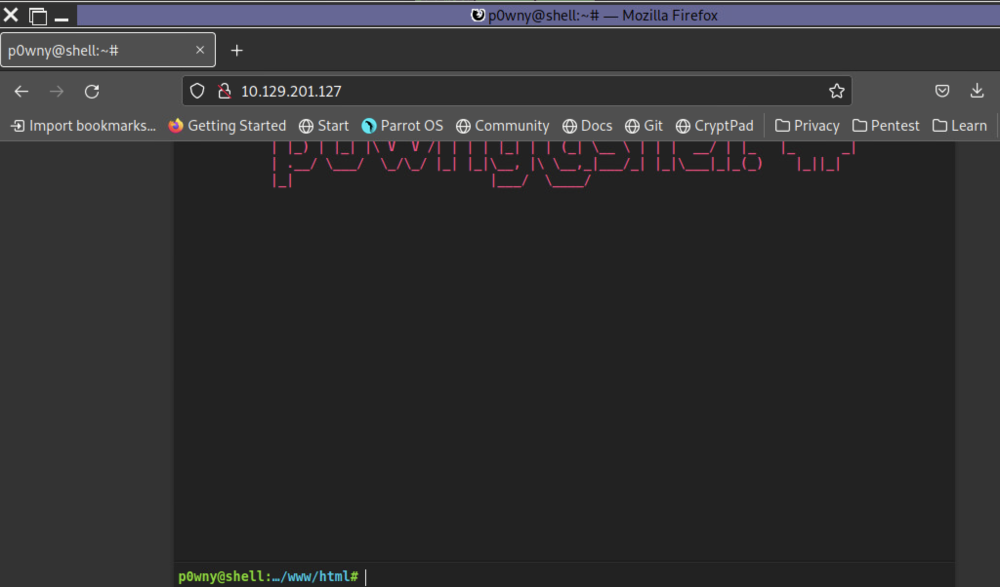

# Notes
## Scenario
A team member started a Penetration Test against the Inlanefreight environment but was moved to another project at the last minute. Luckily for us, they left a web shell in place for us to get back into the network so we can pick up where they left off. We need to leverage the web shell to continue enumerating the hosts, identifying common services, and using those services/protocols to pivot into the internal networks of Inlanefreight. Our detailed objectives are below:

## Objectives
* Start from external (Pwnbox or your own VM) and access the first system via the web shell left in place.
* Use the web shell access to enumerate and pivot to an internal host.
* Continue enumeration and pivoting until you reach the Inlanefreight Domain Controller and capture the associated flag.
* Use any data, credentials, scripts, or other information within the environment to enable your pivoting attempts.
* Grab any/all flags that can be found.

```
**Note:**

Keep in mind the tools and tactics you practiced throughout this module. Each one can provide a different route into the next pivot point. You may find a hop to be straightforward from one set of hosts, but that same tactic may not work to get you to the next. While completing this skills assessment, we encourage you to take proper notes, draw out a map of what you know of already, and plan out your next hop. Trying to do it on the fly will prove difficult without having a visual to reference.
```

**Initial WebShell**




## Questions

1. Once on the webserver, enumerate the host for credentials that can be used to start a pivot or tunnel to another host in the network. In what user's directory can you find the credentials? Submit the name of the user as the answer. 

`/home/webadmin`

2. Submit the credentials found in the user's home directory. (Format: user:password)

`mlefay:Plain Human work!`

3. Enumerate the internal network and discover another active host. Submit the IP address of that host as the answer.

`172.16.5.15`

4. Use the information you gathered to pivot to the discovered host. Submit the contents of C:\Flag.txt as the answer.

`S1ngl3-Piv07-3@sy-Day`

5. In previous pentests against Inlanefreight, we have seen that they have a bad habit of utilizing accounts with services in a way that exposes the users credentials and the network as a whole. What user is vulnerable?

`vfrank`

6. For your next hop enumerate the networks and then utilize a common remote access solution to pivot. Submit the C:\Flag.txt located on the workstation.

`N3tw0rk-H0pp1ng-f0R-FuN`

7. Submit the contents of C:\Flag.txt located on the Domain Controller.

`3nd-0xf-Th3-R@inbow!`

## Webshell

Enumerated the webshell. Found creds and an ssh key. It's not clear who user is for the ssh key. Creds for `mlefay`

**Creds** 
username: `mlefay`
password: `Plain Human work!`

Creds were from `/home/webadmin/for-admin-eyes-only`

```bash
www-data@inlanefreight:/home/webadmin$ cat for-admin-eyes-only
# note to self,
in order to reach server01 or other servers in the subnet from here you have to us the user account:mlefay
with a password of :
Plain Human work!
www-data@inlanefreight:/home/webadmin$
```

The host is dual NIC. It has access to `172.16.5.15/24`

```bash
www-data@inlanefreight.local:/home/webadmin# ifconfig
ens160: flags=4163<UP,BROADCAST,RUNNING,MULTICAST>  mtu 1500
        inet 10.129.229.129  netmask 255.255.0.0  broadcast 10.129.255.255
        inet6 fe80::250:56ff:fe8a:9a74  prefixlen 64  scopeid 0x20<link>
        inet6 dead:beef::250:56ff:fe8a:9a74  prefixlen 64  scopeid 0x0<global>
        ether 00:50:56:8a:9a:74  txqueuelen 1000  (Ethernet)
        RX packets 17355  bytes 1336821 (1.3 MB)
        RX errors 0  dropped 0  overruns 0  frame 0
        TX packets 5784  bytes 440773 (440.7 KB)
        TX errors 0  dropped 0 overruns 0  carrier 0  collisions 0

ens192: flags=4163<UP,BROADCAST,RUNNING,MULTICAST>  mtu 1500
        inet 172.16.5.15  netmask 255.255.0.0  broadcast 172.16.255.255
        inet6 fe80::250:56ff:fe8a:bdf8  prefixlen 64  scopeid 0x20<link>
        ether 00:50:56:8a:bd:f8  txqueuelen 1000  (Ethernet)
        RX packets 1440  bytes 92804 (92.8 KB)
        RX errors 0  dropped 25  overruns 0  frame 0
        TX packets 104  bytes 9116 (9.1 KB)
        TX errors 0  dropped 0 overruns 0  carrier 0  collisions 0

lo: flags=73<UP,LOOPBACK,RUNNING>  mtu 65536
        inet 127.0.0.1  netmask 255.0.0.0
        inet6 ::1  prefixlen 128  scopeid 0x10<host>
        loop  txqueuelen 1000  (Local Loopback)
        RX packets 20433  bytes 1611447 (1.6 MB)
        RX errors 0  dropped 0  overruns 0  frame 0
        TX packets 20433  bytes 1611447 (1.6 MB)
        TX errors 0  dropped 0 overruns 0  carrier 0  collisions 0
```

### nmap enumeration of webshell host

Host has port 22 and 80 open.

```
└─$ sudo nmap -sC -sV -Pn 10.129.229.129 -oN nmap.init
Starting Nmap 7.98 ( https://nmap.org ) at 2026-04-23 09:24 +0800
Nmap scan report for 10.129.229.129
Host is up (0.20s latency).
Not shown: 998 closed tcp ports (reset)
PORT   STATE SERVICE VERSION
22/tcp open  ssh     OpenSSH 8.2p1 Ubuntu 4ubuntu0.4 (Ubuntu Linux; protocol 2.0)
| ssh-hostkey:
|   3072 71:08:b0:c4:f3:ca:97:57:64:97:70:f9:fe:c5:0c:7b (RSA)
|   256 45:c3:b5:14:63:99:3d:9e:b3:22:51:e5:97:76:e1:50 (ECDSA)
|_  256 2e:c2:41:66:46:ef:b6:81:95:d5:aa:35:23:94:55:38 (ED25519)
80/tcp open  http    Apache httpd 2.4.41 ((Ubuntu))
|_http-server-header: Apache/2.4.41 (Ubuntu)
|_http-title: p0wny@shell:~#
Service Info: OS: Linux; CPE: cpe:/o:linux:linux_kernel

Service detection performed. Please report any incorrect results at https://nmap.org/submit/ .
Nmap done: 1 IP address (1 host up) scanned in 18.25 seconds
```

Tried to ssh into webshell host using `mlefay` creds and it didn't work. Might need revshell instead.

`ssh` isn't working well. I tried the `id_rs` and the creds.

## ligolo-ng tunnel setup

Exposed webshell 172.16.5.15 network via ligolo-ng tunnel

```
└─$ ip route | grep ligolo
172.16.0.0/16 dev ligolo scope link
```

Ping sweep revealed another host:

```bash
└─$ # Or quick ping sweep
for i in $(seq 1 254); do
    (ping -c 1 -W 1 172.16.5.$i | grep "bytes from" &)
done
64 bytes from 172.16.5.15: icmp_seq=1 ttl=64 time=354 ms
64 bytes from 172.16.5.35: icmp_seq=1 ttl=64 time=474 ms
```

```bash
www-data@inlanefreight.local:/tmp# ip neigh
172.16.5.46 dev ens192  FAILED
172.16.5.145 dev ens192  FAILED
172.16.5.88 dev ens192  FAILED
172.16.5.47 dev ens192  FAILED
172.16.5.211 dev ens192  FAILED
172.16.5.0 dev ens192  FAILED
172.16.5.52 dev ens192  FAILED
172.16.5.255 dev ens192  FAILED
172.16.5.155 dev ens192  FAILED
172.16.5.1 dev ens192  FAILED
172.16.5.252 dev ens192  FAILED
172.16.5.57 dev ens192  FAILED
10.129.0.1 dev ens160 lladdr 00:50:56:8a:f9:2c REACHABLE
172.16.5.110 dev ens192  FAILED
172.16.5.67 dev ens192  FAILED
172.16.5.176 dev ens192  FAILED
172.16.5.253 dev ens192  FAILED
172.16.5.7 dev ens192  FAILED
172.16.5.35 dev ens192 lladdr 00:50:56:8a:39:d6 STALE
172.16.5.16 dev ens192  FAILED
172.16.5.186 dev ens192  FAILED
172.16.5.109 dev ens192  FAILED
172.16.5.212 dev ens192  FAILED
172.16.5.228 dev ens192  FAILED
172.16.5.38 dev ens192  FAILED
172.16.5.27 dev ens192  FAILED
172.16.5.185 dev ens192  FAILED
172.16.5.96 dev ens192  FAILED
172.16.5.146 dev ens192  FAILED
172.16.5.239 dev ens192  FAILED
172.16.5.54 dev ens192  FAILED
fe80::250:56ff:fe8a:f92c dev ens160 lladdr 00:50:56:8a:f9:2c router STALE
```

Given above, 172.16.5.35 is promising. Doing port scan:

```bash
└─$ sudo nmap -sC -sV -PE -oN nmap.init.internal1 172.16.5.35
Starting Nmap 7.98 ( https://nmap.org ) at 2026-04-23 11:03 +0800
Nmap scan report for 172.16.5.35
Host is up (1.2s latency).
Not shown: 994 closed tcp ports (reset)
PORT     STATE SERVICE       VERSION
22/tcp   open  ssh           OpenSSH for_Windows_8.9 (protocol 2.0)
| ssh-hostkey:
|   256 0e:29:c7:ed:0b:4c:80:87:a7:89:3f:b0:45:59:d9:17 (ECDSA)
|_  256 f3:e7:0b:01:fa:ac:9c:5b:fa:9c:0e:79:10:6c:9d:1f (ED25519)
135/tcp  open  msrpc         Microsoft Windows RPC
139/tcp  open  netbios-ssn   Microsoft Windows netbios-ssn
445/tcp  open  microsoft-ds?
3389/tcp open  ms-wbt-server Microsoft Terminal Services
|_ssl-date: 2026-04-23T03:03:47+00:00; +6s from scanner time.
| ssl-cert: Subject: commonName=PIVOT-SRV01.INLANEFREIGHT.LOCAL
| Not valid before: 2026-04-22T02:39:43
|_Not valid after:  2026-10-22T02:39:43
| rdp-ntlm-info:
|   Target_Name: INLANEFREIGHT
|   NetBIOS_Domain_Name: INLANEFREIGHT
|   NetBIOS_Computer_Name: PIVOT-SRV01
|   DNS_Domain_Name: INLANEFREIGHT.LOCAL
|   DNS_Computer_Name: PIVOT-SRV01.INLANEFREIGHT.LOCAL
|   DNS_Tree_Name: INLANEFREIGHT.LOCAL
|   Product_Version: 10.0.17763
|_  System_Time: 2026-04-23T03:03:36+00:00
5985/tcp open  http          Microsoft HTTPAPI httpd 2.0 (SSDP/UPnP)
|_http-title: Not Found
|_http-server-header: Microsoft-HTTPAPI/2.0
Service Info: OS: Windows; CPE: cpe:/o:microsoft:windows

Host script results:
|_nbstat: NetBIOS name: PIVOT-SRV01, NetBIOS user: <unknown>, NetBIOS MAC: 00:50:56:8a:39:d6 (VMware)
|_clock-skew: mean: 5s, deviation: 0s, median: 5s
| smb2-time:
|   date: 2026-04-23T03:03:36
|_  start_date: N/A
| smb2-security-mode:
|   3.1.1:
|_    Message signing enabled but not required

Service detection performed. Please report any incorrect results at https://nmap.org/submit/ .
Nmap done: 1 IP address (1 host up) scanned in 34.80 seconds
```

SSH to 172.16.5.34 worked using `mlefay` creds:

```
Microsoft Windows [Version 10.0.17763.2628]
(c) 2018 Microsoft Corporation. All rights reserved.

mlefay@PIVOT-SRV01 C:\Users\mlefay>
```

[Enum of PIVOT-SRV01](pivot-srv01-enum.md)

Got Flag.txt

```
mlefay@PIVOT-SRV01 C:\Users\mlefay>cd c:\

mlefay@PIVOT-SRV01 c:\>dir
 Volume in drive C has no label.
 Volume Serial Number is B8B3-0D72

 Directory of c:\

05/17/2022  08:41 AM                21 Flag.txt
02/25/2022  11:20 AM    <DIR>          PerfLogs
05/06/2022  02:30 AM    <DIR>          Program Files
05/06/2022  02:28 AM    <DIR>          Program Files (x86)
05/17/2022  11:14 AM    <DIR>          Users
05/17/2022  11:10 AM    <DIR>          Windows
               1 File(s)             21 bytes
               5 Dir(s)  18,594,816,000 bytes free

mlefay@PIVOT-SRV01 c:\>type Flag.txt
S1ngl3-Piv07-3@sy-Day
```

Check users:

```
mlefay@PIVOT-SRV01 c:\>net user

User accounts for \\PIVOT-SRV01

-------------------------------------------------------------------------------
Administrator            apendragon               DefaultAccount
Guest                    mlefay                   WDAGUtilityAccount
The command completed successfully.


mlefay@PIVOT-SRV01 c:\>net group
This command can be used only on a Windows Domain Controller.

More help is available by typing NET HELPMSG 3515.


mlefay@PIVOT-SRV01 c:\>
```

```
mlefay@PIVOT-SRV01 c:\>wmic service get name,startname
Name                                      StartName
ADWS                                      LocalSystem
AJRouter                                  NT AUTHORITY\LocalService
ALG                                       NT AUTHORITY\LocalService
AppIDSvc                                  NT Authority\LocalService
Appinfo                                   LocalSystem
AppMgmt                                   LocalSystem
AppReadiness                              LocalSystem
AppVClient                                LocalSystem
AppXSvc                                   LocalSystem
AudioEndpointBuilder                      LocalSystem
Audiosrv                                  NT AUTHORITY\LocalService
AxInstSV                                  LocalSystem
BFE                                       NT AUTHORITY\LocalService
BITS                                      LocalSystem
BrokerInfrastructure                      LocalSystem
BTAGService                               NT AUTHORITY\LocalService
BthAvctpSvc                               NT AUTHORITY\LocalService
bthserv                                   NT AUTHORITY\LocalService
camsvc                                    LocalSystem
CDPSvc                                    NT AUTHORITY\LocalService
CertPropSvc                               LocalSystem
ClipSVC                                   LocalSystem
COMSysApp                                 LocalSystem
CoreMessagingRegistrar                    NT AUTHORITY\LocalService
CryptSvc                                  NT Authority\NetworkService
CscService                                LocalSystem
DcomLaunch                                LocalSystem
defragsvc                                 localSystem
DeviceAssociationService                  LocalSystem
DeviceInstall                             LocalSystem
DevQueryBroker                            LocalSystem
Dfs                                       LocalSystem
DFSR                                      LocalSystem
Dhcp                                      NT Authority\LocalService
DHCPServer                                INLANEFREIGHT\vfrank
diagnosticshub.standardcollector.service  LocalSystem
DiagTrack                                 LocalSystem
DmEnrollmentSvc                           LocalSystem
dmwappushservice                          LocalSystem
Dnscache                                  NT AUTHORITY\NetworkService
DoSvc                                     NT Authority\NetworkService
dot3svc                                   localSystem
DPS                                       NT AUTHORITY\LocalService
DsmSvc                                    LocalSystem
DsRoleSvc                                 LocalSystem
DsSvc                                     LocalSystem
Eaphost                                   localSystem
EFS                                       LocalSystem
embeddedmode                              LocalSystem
EntAppSvc                                 LocalSystem
EventLog                                  NT AUTHORITY\LocalService
EventSystem                               NT AUTHORITY\LocalService
fdPHost                                   NT AUTHORITY\LocalService
FDResPub                                  NT AUTHORITY\LocalService
FontCache                                 NT AUTHORITY\LocalService
FrameServer                               NT AUTHORITY\LocalService
gpsvc                                     LocalSystem
GraphicsPerfSvc                           LocalSystem
hidserv                                   LocalSystem
HvHost                                    LocalSystem
icssvc                                    NT Authority\LocalService
IKEEXT                                    LocalSystem
InstallService                            LocalSystem
iphlpsvc                                  LocalSystem
IsmServ                                   LocalSystem
Kdc                                       LocalSystem
KdsSvc                                    LocalSystem
KeyIso                                    LocalSystem
KPSSVC                                    NT AUTHORITY\NetworkService
KtmRm                                     NT AUTHORITY\NetworkService
LanmanServer                              LocalSystem
LanmanWorkstation                         NT AUTHORITY\NetworkService
lfsvc                                     LocalSystem
LicenseManager                            NT Authority\LocalService
lltdsvc                                   NT AUTHORITY\LocalService
lmhosts                                   NT AUTHORITY\LocalService
LSM                                       LocalSystem
MapsBroker                                NT AUTHORITY\NetworkService
mpssvc                                    NT Authority\LocalService
MSDTC                                     NT AUTHORITY\NetworkService
MSiSCSI                                   LocalSystem
msiserver                                 LocalSystem
NcaSvc                                    LocalSystem
NcbService                                LocalSystem
Netlogon                                  LocalSystem
Netman                                    LocalSystem
netprofm                                  NT AUTHORITY\LocalService
NetSetupSvc                               LocalSystem
NetTcpPortSharing                         NT AUTHORITY\LocalService
NgcCtnrSvc                                NT AUTHORITY\LocalService
NgcSvc                                    LocalSystem
NlaSvc                                    NT AUTHORITY\NetworkService
nsi                                       NT Authority\LocalService
NTDS                                      LocalSystem
NtFrs                                     LocalSystem
PcaSvc                                    LocalSystem
PerfHost                                  NT AUTHORITY\LocalService
PhoneSvc                                  NT Authority\LocalService
pla                                       NT AUTHORITY\LocalService
PlugPlay                                  LocalSystem
PolicyAgent                               NT Authority\NetworkService
Power                                     LocalSystem
PrintNotify                               LocalSystem
ProfSvc                                   LocalSystem
PushToInstall                             LocalSystem
QWAVE                                     NT AUTHORITY\LocalService
RasAuto                                   localSystem
RasMan                                    localSystem
RemoteAccess                              localSystem
RemoteRegistry                            NT AUTHORITY\LocalService
RmSvc                                     NT AUTHORITY\LocalService
RpcEptMapper                              NT AUTHORITY\NetworkService
RpcLocator                                NT AUTHORITY\NetworkService
RpcSs                                     NT AUTHORITY\NetworkService
RSoPProv                                  LocalSystem
sacsvr                                    LocalSystem
SamSs                                     LocalSystem
SCardSvr                                  INLANEFREIGHT\vfrank
ScDeviceEnum                              LocalSystem
Schedule                                  LocalSystem
SCPolicySvc                               LocalSystem
seclogon                                  LocalSystem
SecurityHealthService                     LocalSystem
SEMgrSvc                                  NT AUTHORITY\LocalService
SENS                                      LocalSystem
Sense                                     LocalSystem
SensorDataService                         LocalSystem
SensorService                             LocalSystem
SensrSvc                                  NT AUTHORITY\LocalService
SessionEnv                                localSystem
SgrmBroker                                LocalSystem
SharedAccess                              LocalSystem
ShellHWDetection                          LocalSystem
shpamsvc                                  LocalSystem
smphost                                   NT AUTHORITY\NetworkService
SNMPTRAP                                  NT AUTHORITY\LocalService
Spooler                                   LocalSystem
sppsvc                                    NT AUTHORITY\NetworkService
SSDPSRV                                   NT AUTHORITY\LocalService
ssh-agent                                 LocalSystem
sshd                                      LocalSystem
SstpSvc                                   NT Authority\LocalService
StateRepository                           LocalSystem
stisvc                                    NT Authority\LocalService
StorSvc                                   LocalSystem
svsvc                                     LocalSystem
swprv                                     LocalSystem
SysMain                                   LocalSystem
SystemEventsBroker                        LocalSystem
TabletInputService                        LocalSystem
tapisrv                                   NT AUTHORITY\NetworkService
TermService                               NT Authority\NetworkService
Themes                                    LocalSystem
TieringEngineService                      localSystem
TimeBrokerSvc                             NT AUTHORITY\LocalService
TokenBroker                               LocalSystem
TrkWks                                    LocalSystem
TrustedInstaller                          localSystem
tzautoupdate                              NT AUTHORITY\LocalService
UALSVC                                    LocalSystem
UevAgentService                           LocalSystem
UmRdpService                              localSystem
upnphost                                  NT AUTHORITY\LocalService
UserManager                               LocalSystem
UsoSvc                                    LocalSystem
VaultSvc                                  LocalSystem
vds                                       LocalSystem
VGAuthService                             LocalSystem
VM3DService                               LocalSystem
vmicguestinterface                        LocalSystem
vmicheartbeat                             LocalSystem
vmickvpexchange                           LocalSystem
vmicrdv                                   LocalSystem
vmicshutdown                              LocalSystem
vmictimesync                              NT AUTHORITY\LocalService
vmicvmsession                             LocalSystem
vmicvss                                   LocalSystem
VMTools                                   LocalSystem
vmvss                                     LocalSystem
VSS                                       LocalSystem
W32Time                                   NT AUTHORITY\LocalService
WaaSMedicSvc                              LocalSystem
WalletService                             LocalSystem
WarpJITSvc                                NT Authority\LocalService
WbioSrvc                                  LocalSystem
Wcmsvc                                    NT Authority\LocalService
WdiServiceHost                            NT AUTHORITY\LocalService
WdiSystemHost                             LocalSystem
Wecsvc                                    NT AUTHORITY\NetworkService
WEPHOSTSVC                                NT AUTHORITY\LocalService
wercplsupport                             localSystem
WerSvc                                    localSystem
WiaRpc                                    LocalSystem
WinHttpAutoProxySvc                       NT AUTHORITY\LocalService
Winmgmt                                   localSystem
WinRM                                     NT AUTHORITY\NetworkService
wisvc                                     LocalSystem
wlidsvc                                   LocalSystem
wmiApSrv                                  localSystem
WMPNetworkSvc                             NT AUTHORITY\NetworkService
WPDBusEnum                                LocalSystem
WpnService                                LocalSystem
WSearch                                   LocalSystem
wuauserv                                  LocalSystem
```