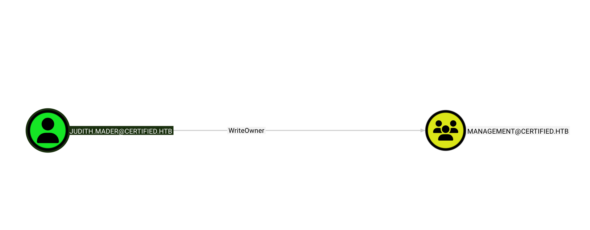
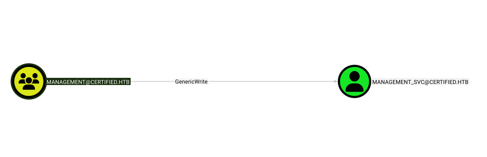

# Bloodhound Enumeration - Judith Maher

* Got AD data using judith.maher and judith09. See [certified_bloodhound](../loot/certified_bloodhound.zip) for the output.
* Judith Maher has WriteOwner permission for management@certified.htb group

* The management@certified.htb group has generic write over management_svc@certified.htb user.

* management_svc@certified.htb user is a member of remote management users group, domain user group, and management group.

Found that management_svc has GenericAll permission for ca_operator@certified.htb user. 

